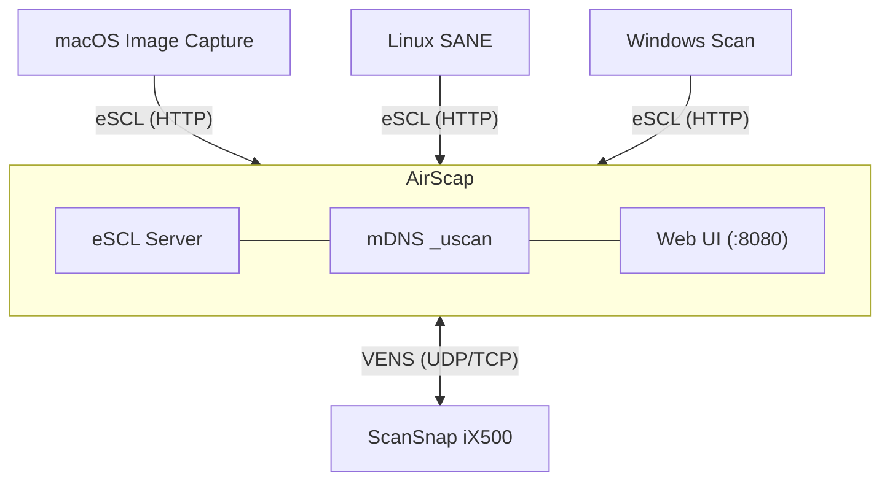

<h2 align="center">AirScap</h2>

<h3 align="center">AirScan bridge for legacy Wi-Fi ScanSnap scanners</h3>

<p align="center">
  <a href="https://github.com/mzyy94/airscap/actions/workflows/test.yml"></a>
  <a href="https://github.com/mzyy94/airscap/releases"></a>
  <a href="LICENSE"></a>
</p>

<p align="center">
  <a href="#installation">Installation</a>&ensp;&bull;&ensp;
  <a href="#quick-start">Quick Start</a>&ensp;&bull;&ensp;
  <a href="#web-ui">Web UI</a>&ensp;&bull;&ensp;
  <a href="#configuration">Configuration</a>&ensp;&bull;&ensp;
  <a href="protocol.en.md">Protocol Docs</a>&ensp;&bull;&ensp;
  <a href="README.md">日本語</a>
</p>

---

## What is AirScap?

The **ScanSnap Connect Application** that enabled Wi-Fi scanning for the iX500 has been discontinued. The currently available ScanSnap Home does not support the iX500, leaving no way to scan over Wi-Fi. AirScap is a protocol bridge that brings legacy ScanSnap scanners including the iX500 back to life by making them AirScan-compatible.

It natively implements the proprietary **VENS** protocol used by ScanSnap iX500 over Wi-Fi in Go, and exposes it as a standard **eSCL (AirScan)** network scanner.

| Platform | Client |
|----------|--------|
| **macOS** | Image Capture, Preview |
| **Linux** | SANE (`sane-airscan`), scanservjs |
| **Windows** | Windows Scan (WSD) |

## Architecture



## Features

- **Driver-free scanning** &mdash; Works with any eSCL/AirScan client out of the box
- **Zero configuration** &mdash; Auto-discovers ScanSnap on the network and connects
- **Versatile scanning** &mdash; Color / grayscale / B&W, duplex, PDF / JPEG / TIFF output, JPEG quality control, blank page removal, bleed-through reduction
- **Physical button support** &mdash; Press the scanner button to trigger a scan job. Save to local folder / FTP / [Paperless-ngx] from your choice
- **Web UI** &mdash; Configure settings and monitor status from your browser (English / Japanese)
- **Single binary** &mdash; Pure Go, no CGO required, cross-compilable. Ships with a systemd service unit

[Paperless-ngx]: https://github.com/paperless-ngx/paperless-ngx

## Tested Environment

Development and testing were done with a **ScanSnap iX500** and **macOS Image Capture**. Other ScanSnap models using the same VENS protocol may work but have not been tested. Compatibility with other client software (SANE, Windows Scan, etc.) is not guaranteed.

> [!TIP]
> **Using USB on Linux?** The standard SANE driver [`sane-epjitsu`](http://www.sane-project.org/man/sane-epjitsu.5.html) supports the ScanSnap iX500 over USB. AirScap is designed for Wi-Fi scanning only &mdash; if you have a USB connection, use the SANE driver instead.

## Installation

### From Release (Debian/Ubuntu)

Download the `.deb` package from the [Releases](https://github.com/mzyy94/airscap/releases) page:

```bash
# Download the latest release
curl -LO https://github.com/mzyy94/airscap/releases/latest/download/airscap_amd64.deb

# Install
sudo dpkg -i airscap_amd64.deb

# Edit configuration
sudo vi /etc/airscap/env

# Start the service
sudo systemctl enable --now airscap
```

The deb package includes the binary, systemd service unit, and default configuration.

### From Source

Requires Go 1.25+.

```bash
git clone https://github.com/mzyy94/airscap.git
cd airscap
go mod vendor
CGO_ENABLED=0 go build -mod=vendor -overlay=build/overlay.json -o airscap ./cmd/airscap/
```

> [!NOTE]
> If CGO is available (libjpeg / libpng installed), you can build without vendor or overlay:
> ```bash
> go build -o airscap ./cmd/airscap/
> ```

### systemd (manual)

```bash
sudo cp airscap /usr/local/bin/
sudo cp dist/airscap.service /etc/systemd/system/
sudo mkdir -p /etc/airscap
sudo cp dist/env.example /etc/airscap/env
sudo vi /etc/airscap/env

sudo systemctl daemon-reload
sudo systemctl enable --now airscap
```

## Quick Start

```bash
# Auto-discover scanner, auto-derive password from serial number
./airscap

# Or specify password explicitly
AIRSCAP_PASSWORD=0700 ./airscap

# Specify scanner IP directly
AIRSCAP_PASSWORD=0700 AIRSCAP_SCANNER_IP=192.168.1.100 ./airscap
```

Once running, AirScap will:

1. Discover your ScanSnap on the local network (or connect to the specified IP)
2. Pair using the scanner password
3. Start an eSCL server on port 8080
4. Register via mDNS so clients discover it automatically
5. Serve a Web UI at `http://localhost:8080/ui/`

> [!IMPORTANT]
> AirScap cannot perform the initial Wi-Fi setup of the scanner (connecting it to an access point).
> Use the ScanSnap setup tool or the WPS button to connect the scanner to your network beforehand.

## Web UI

Access the built-in management interface at `http://<host>:8080/ui/`.

- **Status** &mdash; Connection state, ADF paper presence, error states (paper jam, cover open, multi-feed)
- **Device Info** &mdash; Scanner name, serial, IP, firmware revision
- **Button Scan Settings** &mdash; Color mode, resolution, paper size, output format, JPEG quality, duplex, blank page removal, bleed-through reduction
- **Save Destination** &mdash; Configure local folder / FTP / Paperless-ngx for button scans
- **AirScan Settings** &mdash; Auto paper size detect, bleed-through reduction, B&W density overrides for AirScan clients
- **eSCL Endpoint** &mdash; URL for manual eSCL client configuration
- **i18n** &mdash; English / Japanese toggle

## Configuration

Scanner discovery and startup settings are configured via environment variables.

| Variable | Default | Description | Notes |
|---|---|---|---|
| `AIRSCAP_PASSWORD` | auto-derive | Scanner pairing password | \* |
| `AIRSCAP_PASSWORD_FILE` | &mdash; | Path to password file | \* |
| `AIRSCAP_SCANNER_IP` | auto-discover | Scanner IP address | |
| `AIRSCAP_LISTEN_PORT` | `8080` | HTTP listen port | |
| `AIRSCAP_DEVICE_NAME` | from scanner | mDNS display name | |
| `AIRSCAP_LOG_LEVEL` | `info` | Log level (`debug` / `info` / `warn` / `error`) | |
| `AIRSCAP_DATA_DIR` | no persistence | Directory for persistent settings | \*\* |

\* If you have changed the default password, specify the password you set. Use one or the other.
\*\* When running under systemd, settings are persisted to `STATE_DIRECTORY` even if unset.

See [`dist/env.example`](dist/env.example) for a full template.

## Verify

```bash
# Check mDNS advertisement (macOS)
dns-sd -B _uscan._tcp

# Check eSCL capabilities
curl -s http://localhost:8080/eSCL/ScannerCapabilities | head -20

# Scan via SANE
scanimage -L
scanimage --device 'airscan:e0:ScanSnap iX500' --format=jpeg -o scan.jpg
```

## Protocol

AirScap implements the **VENS** protocol &mdash; a proprietary binary protocol used by Fujitsu/Ricoh ScanSnap scanners over Wi-Fi. The implementation is based on analysis of packet captures from the official application.

Full protocol documentation:
- [protocol.md](protocol.md) (Japanese)
- [protocol.en.md](protocol.en.md) (English)

## License

[MIT](LICENSE)

### Third-party Licenses

This software uses the following open-source libraries:

| Library | License |
|---|---|
| [go-mfp](https://github.com/OpenPrinting/go-mfp) | BSD 2-Clause |
| [go-pdf/fpdf](https://codeberg.org/go-pdf/fpdf) | MIT |
| [zeroconf](https://github.com/grandcat/zeroconf) | MIT |
| [jlaffaye/ftp](https://github.com/jlaffaye/ftp) | ISC |
| [golang.org/x/image](https://pkg.go.dev/golang.org/x/image) | BSD 3-Clause |
| [Alpine.js](https://alpinejs.dev/) | MIT |
| [Bulma](https://bulma.io/) | MIT |
| [Feather Icons](https://feathericons.com/) | MIT |

