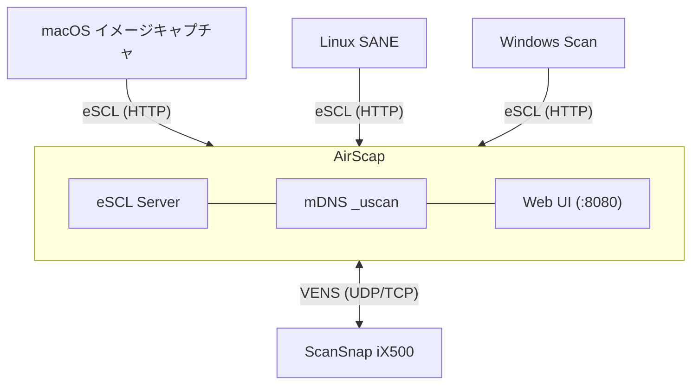

<h2 align="center">AirScap</h2>

<h3 align="center">レガシー Wi-Fi ScanSnap 向け AirScan ブリッジ</h3>

<p align="center">
  <a href="https://github.com/mzyy94/airscap/actions/workflows/ci.yml"></a>
  <a href="https://github.com/mzyy94/airscap/releases"></a>
  <a href="LICENSE"></a>
</p>

<p align="center">
  <a href="#インストール">インストール</a>&ensp;&bull;&ensp;
  <a href="#クイックスタート">クイックスタート</a>&ensp;&bull;&ensp;
  <a href="#web-ui">Web UI</a>&ensp;&bull;&ensp;
  <a href="#設定">設定</a>&ensp;&bull;&ensp;
  <a href="protocol.md">プロトコル仕様</a>&ensp;&bull;&ensp;
  <a href="README.en.md">🇺🇸 English</a>
</p>

---

## AirScap とは

ScanSnap iX500 の Wi-Fi スキャンを支えていた **ScanSnap Connect Application** は提供を終了していました。現在公開されているScanSnap Homeは iX500 をサポートしておらず、無線LANによるスキャンをする術を失ってしまいました。 AirScap は、 iX500 を含むレガシーな ScanSnap を AirScan プロトコルに対応させ、無線経由のスキャンを蘇らせるプロトコルブリッジです。

ScanSnap iX500 が Wi-Fi で使用する独自プロトコル **VENS** を Go でネイティブ実装し、標準的な **eSCL (AirScan)** ネットワークスキャナとして公開します。

| プラットフォーム | クライアント |
|----------|--------|
| **macOS** | イメージキャプチャ、プレビュー |
| **Linux** | SANE (`sane-airscan`)、scanservjs |
| **Windows** | Windows Scan (WSD) |

## アーキテクチャ



## 特徴

- **ドライバ不要** &mdash; eSCL/AirScan 対応クライアントからそのまま利用可能
- **ゼロコンフィグ** &mdash; ネットワーク上の ScanSnap を自動検出して接続
- **多彩なスキャン** &mdash; カラー / グレースケール / 白黒、両面、PDF / JPEG / TIFF 出力、白紙スキップ、裏写り軽減に対応
- **物理ボタン対応** &mdash; スキャナ本体のボタンを押してスキャンジョブを実行。保存先はローカル / FTP / [Paperless-ngx] から選択
- **Web UI** &mdash; ブラウザから設定変更やステータス確認が可能（英語 / 日本語）
- **シングルバイナリ** &mdash; Go言語製、ランタイム依存なし。systemd サービスユニット同梱

[Paperless-ngx]: https://github.com/paperless-ngx/paperless-ngx

## 動作確認済み環境

開発・テストは **ScanSnap iX500** と **macOS イメージキャプチャ**で行っています。同じ VENS プロトコルを使用する他の ScanSnap モデルでも動作する可能性がありますが、未検証です。他のクライアントソフトウェア（SANE、Windows Scan 等）との互換性も保証されていません。

> [!TIP]
> **Linux で USB 接続する場合:** USB 接続であれば SANE の標準ドライバ [`sane-epjitsu`](http://www.sane-project.org/man/sane-epjitsu.5.html) が ScanSnap iX500 をサポートしています。AirScap は Wi-Fi 経由でのスキャンを実現するためのものなので、USB 接続の場合は SANE ドライバをお使いください。

## インストール

### リリースパッケージ（Debian/Ubuntu）

[Releases](https://github.com/mzyy94/airscap/releases) ページから `.deb` パッケージをダウンロード：

```bash
# 最新リリースをダウンロード
curl -LO https://github.com/mzyy94/airscap/releases/latest/download/airscap_amd64.deb

# インストール
sudo apt install airscap_amd64.deb

# 設定を編集
sudo vi /etc/airscap/env

# サービスを起動
sudo systemctl enable --now airscap
```

deb パッケージにはバイナリ、systemd サービスユニット、デフォルト設定ファイルが含まれます。

### ソースからビルド

Go 1.25 以上が必要です。

```bash
go install github.com/mzyy94/airscap/cmd/airscap@latest
```

またはクローンしてビルド：

```bash
git clone https://github.com/mzyy94/airscap.git
cd airscap
go build -o airscap ./cmd/airscap/
```

### systemd（手動セットアップ）

```bash
sudo cp airscap /usr/local/bin/
sudo cp dist/airscap.service /etc/systemd/system/
sudo mkdir -p /etc/airscap
sudo cp dist/env.example /etc/airscap/env
sudo vi /etc/airscap/env

sudo systemctl daemon-reload
sudo systemctl enable --now airscap
```

## クイックスタート

```bash
# スキャナを自動検出、パスワードをシリアル番号から自動導出
./airscap

# パスワードを明示的に指定
AIRSCAP_PASSWORD=0700 ./airscap

# スキャナの IP を直接指定
AIRSCAP_PASSWORD=0700 AIRSCAP_SCANNER_IP=192.168.1.100 ./airscap
```

起動すると AirScap は以下を行います：

1. ローカルネットワーク上の ScanSnap を検出（または指定 IP に接続）
2. スキャナのパスワードでペアリング
3. ポート 8080 で eSCL サーバーを起動
4. mDNS 登録でクライアントから自動検出可能に
5. `http://localhost:8080/ui/` で Web UI を提供

> [!IMPORTANT]
> スキャナ本体の Wi-Fi 初期設定（アクセスポイントへの接続）は AirScap では行えません。
> 事前に ScanSnap のセットアップツールまたは WPS ボタンを使用して、スキャナをネットワークに接続しておいてください。

## Web UI

`http://<host>:8080/ui/` で管理画面にアクセスできます。

- **ステータス** &mdash; 接続状態、ADF の用紙有無、エラー状態（紙詰まり・カバーオープン・重送検知）
- **デバイス情報** &mdash; スキャナ名、シリアル番号、IP、ファームウェアリビジョン
- **ボタンスキャン設定** &mdash; カラーモード、解像度、用紙サイズ、出力形式、両面、白紙スキップ、裏写り軽減
- **保存先** &mdash; ローカルフォルダ / FTP / Paperless-ngx のボタンスキャン保存先設定
- **AirScan 設定** &mdash; 用紙サイズ自動検出、裏写り軽減、白黒濃度の AirScan クライアント向けオーバーライド
- **eSCL エンドポイント** &mdash; eSCL クライアント手動設定用の URL
- **多言語対応** &mdash; 英語 / 日本語切り替え

## 設定

スキャナーの探索や起動などに関する設定は環境変数で行います。

| 変数 | デフォルト | 説明 | 注釈 |
|---|---|---|---|
| `AIRSCAP_PASSWORD` | 自動導出 | スキャナのペアリングパスワード | \* |
| `AIRSCAP_PASSWORD_FILE` | &mdash; | パスワードファイルのパス | \* |
| `AIRSCAP_SCANNER_IP` | 自動検出 | スキャナの IP アドレス | |
| `AIRSCAP_LISTEN_PORT` | `8080` | HTTP リッスンポート | |
| `AIRSCAP_DEVICE_NAME` | スキャナから取得 | mDNS 表示名 | |
| `AIRSCAP_LOG_LEVEL` | `info` | ログレベル（`debug` / `info` / `warn` / `error`） | |
| `AIRSCAP_DATA_DIR` | 永続化しない | 設定永続化ディレクトリ | \*\* |

\* デフォルトパスワードから変更している場合は、設定したパスワードを指定する必要があります。いずれか片方で指定してください。
\*\* systemdで起動している場合は、未指定でも `STATE_DIRECTORY` に保存され永続化されます。

テンプレートは [`dist/env.example`](dist/env.example) を参照。

## 動作確認

```bash
# mDNS 登録の確認（macOS）
dns-sd -B _uscan._tcp

# eSCL ケーパビリティの確認
curl -s http://localhost:8080/eSCL/ScannerCapabilities | head -20

# SANE でスキャン
scanimage -L
scanimage --device 'airscan:e0:ScanSnap iX500' --format=jpeg -o scan.jpg
```

## プロトコル

AirScap は **VENS** プロトコルを実装しています。これは富士通/リコーの ScanSnap スキャナが Wi-Fi 通信で使用する独自バイナリプロトコルで、公式アプリケーションのパケットキャプチャを解析して実装しました。

プロトコルの詳細仕様：
- [protocol.md](protocol.md)（日本語）
- [protocol.en.md](protocol.en.md)（English）

## ライセンス

[MIT](LICENSE)
