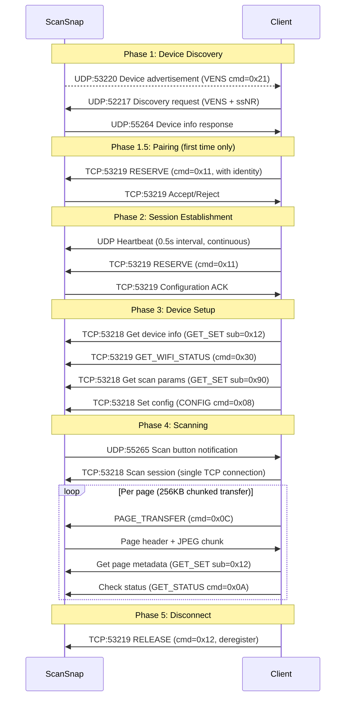
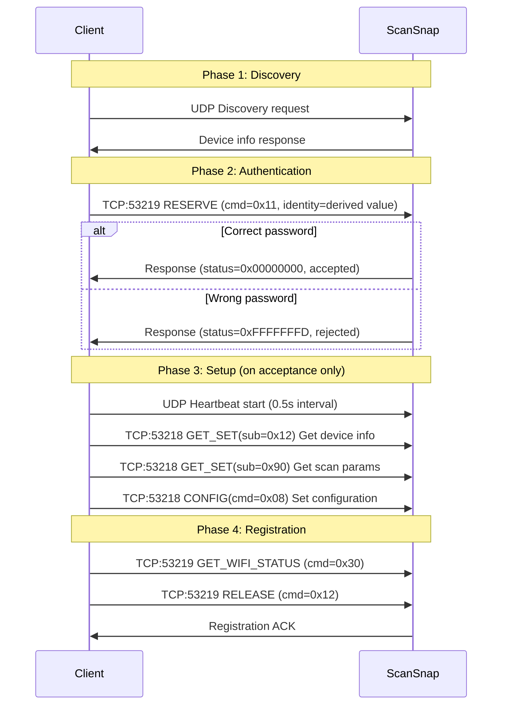
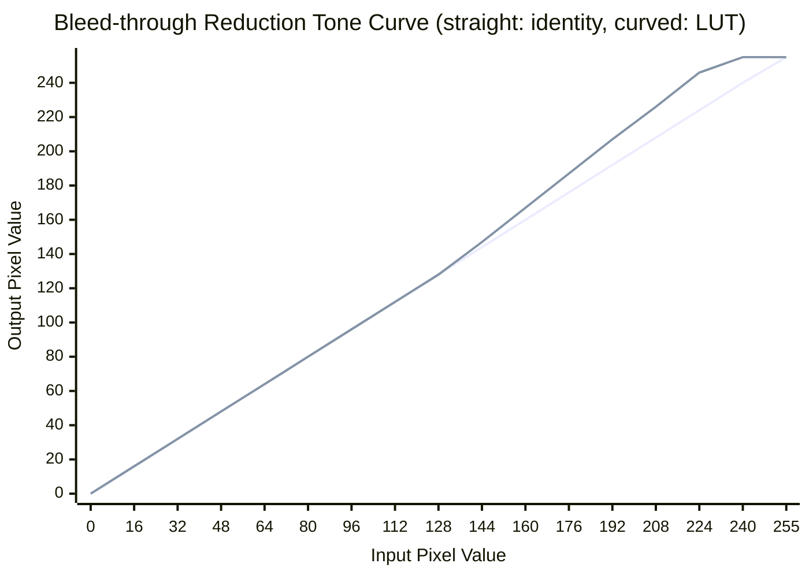
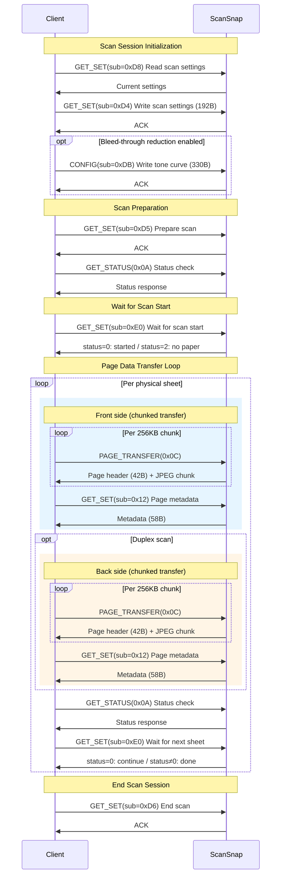
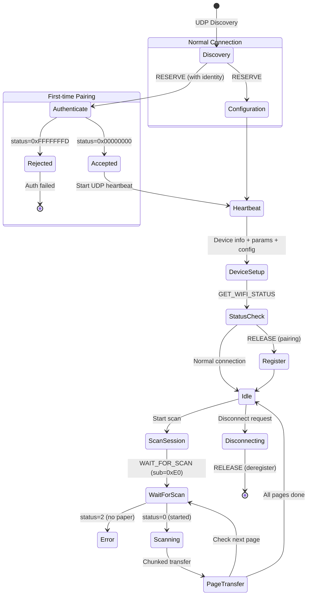

# Legacy ScanSnap Network Protocol Specification

This document summarizes the network protocol reconstructed from packet captures taken while operating the ScanSnap iX500 over a network. It is not an official specification and therefore may not be exact or guaranteed to be accurate.

## 1. Overview

The ScanSnap iX500 communicates with client applications (iOS/Android) over Wi-Fi to configure scan settings and transfer scanned data. The protocol uses a proprietary binary format with the magic bytes `VENS` (`0x56454e53`) as a common identifier. All multi-byte integers are **big-endian**.

### 1.1 Network Architecture

The ScanSnap (server) listens on TCP ports 53218/53219. Clients connect to these ports. Device discovery is performed over UDP.

### 1.2 Port Assignment

| Port | Protocol | Direction | Purpose |
|------|----------|-----------|---------|
| 53218 | TCP | Server listen | Data channel (settings R/W, scan data transfer) |
| 53219 | TCP | Server listen | Control channel (session management, status) |
| 53220 | UDP | Broadcast receive | Device advertisement (scanner broadcasts) |
| 52217 | UDP | Server side | Discovery response |
| 55264 | UDP | Client side | Discovery request |
| 55265 | UDP | Client listen | Event notification (scan button press, etc.) |

### 1.3 Communication Flow



---

## 2. Common Packet Structure

### 2.1 VENS Packet Header

```
 0                   1                   2                   3
 0 1 2 3 4 5 6 7 8 9 0 1 2 3 4 5 6 7 8 9 0 1 2 3 4 5 6 7 8 9 0 1
+-+-+-+-+-+-+-+-+-+-+-+-+-+-+-+-+-+-+-+-+-+-+-+-+-+-+-+-+-+-+-+-+
|                      Packet Length                            |
+-+-+-+-+-+-+-+-+-+-+-+-+-+-+-+-+-+-+-+-+-+-+-+-+-+-+-+-+-+-+-+-+
|                    Magic ("VENS" = 0x56454e53)                |
+-+-+-+-+-+-+-+-+-+-+-+-+-+-+-+-+-+-+-+-+-+-+-+-+-+-+-+-+-+-+-+-+
|                     Command / Direction                       |
+-+-+-+-+-+-+-+-+-+-+-+-+-+-+-+-+-+-+-+-+-+-+-+-+-+-+-+-+-+-+-+-+
|                      Status / Flags                           |
+-+-+-+-+-+-+-+-+-+-+-+-+-+-+-+-+-+-+-+-+-+-+-+-+-+-+-+-+-+-+-+-+
|                      Payload (variable)                       |
+-+-+-+-+-+-+-+-+-+-+-+-+-+-+-+-+-+-+-+-+-+-+-+-+-+-+-+-+-+-+-+-+
```

| Offset | Size | Field | Description |
|--------|------|-------|-------------|
| 0 | 4 | Packet Length | Total packet size in bytes (including this field) |
| 4 | 4 | Magic | Fixed `0x56454e53` (ASCII: "VENS") |
| 8 | 4 | Command / Direction | Control channel: command code; Data channel: direction |
| 12 | 4 | Status / Flags | Status code or flags |
| 16+ | var | Payload | Command-specific data |

### 2.2 Channel-Specific Header Differences

The control channel (TCP:53219) and data channel (TCP:53218) interpret bytes at offset 8+ differently.

**Control Channel:**

| Offset | Size | Field |
|--------|------|-------|
| 8 | 4 | Command code (0x11–0x15, 0x30–0x31, 0x50–0x51, 0x62) |
| 12 | 4 | Flags / Status |
| 16 | 8 | Session token |
| 24+ | var | Command parameters |

**Data Channel — Client Request:**

| Offset | Size | Field |
|--------|------|-------|
| 8 | 4 | Direction (fixed: `0x00000001` = C→S) |
| 12 | 4 | Reserved (`0x00000000`) |
| 16 | 8 | Session token |
| 24 | 8 | Reserved |
| 32 | 4 | CDB Length (SCSI Command Descriptor Block byte count) |
| 36 | 12 | CDB parameters / Reserved |
| 48 | CDB Length | SCSI CDB (first byte is the SCSI opcode) |

**Data Channel — Server Response:**

| Offset | Size | Field |
|--------|------|-------|
| 8 | 4 | Direction (fixed: `0x00000000` = S→C) |
| 12 | 4 | Status code |
| 16 | 24 | Reserved (zero-filled) |
| 40+ | var | Response data |

---

## 3. UDP Discovery Protocol

### 3.1 Device Advertisement

The ScanSnap periodically broadcasts a 48-byte advertisement packet to UDP port 53220.

| Offset | Size | Field | Value |
|--------|------|-------|-------|
| 0 | 4 | Packet Length | `0x00000030` (48) |
| 4 | 4 | Magic | "VENS" |
| 8 | 4 | Command | `0x00000021` |
| 12 | 4 | Reserved | `0x00000000` |
| 16 | 4 | Device Flags | `0x01000000` |
| 20 | 4 | Device IP | Scanner IPv4 address (network byte order) |
| 24 | 8 | Device ID | MAC address (6 bytes) + padding |
| 32 | 16 | Reserved | Zero-filled |

### 3.2 Discovery Request (Client → Scanner)

The client sends two packets as a pair to UDP port 52217.

**VENS Request (32 bytes):**

| Offset | Size | Field | Description |
|--------|------|-------|-------------|
| 0 | 4 | Magic | `0x56454e53` ("VENS") |
| 4 | 4 | Flags | `0x00000000` (discovery) / `0x00000001` (heartbeat) |
| 8 | 4 | Client IP | Client IPv4 address |
| 12 | 8 | Session Token | Session token (6 random bytes + `0x0000`) |
| 20 | 4 | Client UDP Port | Client discovery port (55264) |
| 24 | 8 | Flags / Reserved | `0x0010000000000000` |

**ssNR Request (32 bytes):**

| Offset | Size | Field | Description |
|--------|------|-------|-------------|
| 0 | 4 | Magic | `0x73734e52` ("ssNR") |
| 4 | 4 | Reserved | `0x00000000` |
| 8 | 4 | Client IP | Client IPv4 address |
| 12 | 8 | Session Token | Same token as VENS request |
| 20 | 4 | Client UDP Port | 55264 |
| 24 | 8 | Reserved | `0x0100000000000000` |

The ssNR packet is sent paired with the VENS request and conveys client network information.

### 3.3 Discovery Response (Scanner → Client)

The scanner responds with a 132-byte device information packet from UDP port 52217 to the client's UDP port 55264.

| Offset | Size | Field | Description |
|--------|------|-------|-------------|
| 0 | 4 | Magic | "VENS" |
| 4 | 2 | Paired Status | `0x0000`=not connected / `0x0001`=connected |
| 6 | 2 | Reserved | `0x0000` |
| 8 | 2 | Protocol Version | `0x0004` |
| 10 | 2 | Sub-type | `0x0030` |
| 12 | 4 | Broadcast Mask | `0xFFFFFFFF` |
| 16 | 4 | Device IP | Scanner IPv4 address |
| 20 | 2 | Reserved | `0x0000` |
| 22 | 2 | TCP Data Port | Data channel port (typically 53218) |
| 24 | 2 | Reserved | `0x0000` |
| 26 | 2 | TCP Control Port | Control channel port (typically 53219) |
| 28 | 6 | Device MAC | Scanner MAC address |
| 34 | 2 | Reserved | `0x0000` |
| 36 | 4 | State | `0x00000001`=not connected / `0x00000003`=connected |
| 40 | 64 | Serial Number | Device serial number (null-padded ASCII) |
| 104 | 16 | Display Name | Device display name (null-padded ASCII) |
| 120 | 4 | Connected Client IP | Connected client IP (`0x00000000` if none) |
| 124 | 8 | Device Metadata | Device metadata |

### 3.4 Event Notification (Scanner → Client)

When the scan button is pressed, the scanner sends a 48-byte notification packet to the client's UDP port 55265. The notification is sent multiple times at ~0.5s intervals.

| Offset | Size | Field | Description |
|--------|------|-------|-------------|
| 0 | 4 | Packet Length | `0x00000030` (48) |
| 4 | 4 | Magic | "VENS" |
| 8 | 4 | Event Type | `0x00000001` = scan button press |
| 12 | 4 | Reserved | `0x00000000` |
| 16 | 4 | Event Data | `0x02000000` |
| 20 | 28 | Reserved | Zero-filled |

Upon receiving this notification, the client initiates a TCP connection for scan data transfer.

---

## 4. TCP Control Channel (Port 53219)

Used for session management. At the start of every TCP connection, the server sends a Welcome packet (16 bytes).

**Welcome Packet (16 bytes):**

| Offset | Size | Field | Value |
|--------|------|-------|-------|
| 0 | 4 | Length | `0x00000010` (16) |
| 4 | 4 | Magic | "VENS" |
| 8 | 8 | Reserved | `0x0000000000000000` |

### 4.1 Command List

| Command Code | Name | Direction | Description |
|-------------|------|-----------|-------------|
| `0x00000011` | RESERVE | C→S | Reserve scanner (send client configuration) |
| `0x00000012` | RELEASE | C→S | Release scanner (session registration / deregistration) |
| `0x00000013` | GET_DEV_INFO | C→S | Get device info |
| `0x00000014` | SET_DEV_INFO | C→S | Set device info |
| `0x00000015` | UPDATE_PSW | C→S | Update scanner password |
| `0x00000030` | GET_WIFI_STATUS | C→S | Wi-Fi status check |
| `0x00000031` | SET_WIFI_MODE | C→S | Set Wi-Fi mode (infrastructure / direct) |
| `0x00000050` | XFER_DATA | C→S | Data transfer |
| `0x00000051` | FIRM_UPDATE | C→S | Firmware update |
| `0x00000062` | SET_START_MODE | C→S | Set scanner start mode |

### 4.2 Session Registration (RELEASE: 0x12)

Used for session registration and deregistration.

**Request (32 bytes):**

| Offset | Size | Field | Value |
|--------|------|-------|-------|
| 0 | 4 | Length | `0x00000020` (32) |
| 4 | 4 | Magic | "VENS" |
| 8 | 4 | Command | `0x00000012` |
| 12 | 4 | Flags | `0x00000000` |
| 16 | 8 | Token | Session token |
| 24 | 4 | Action | `0x00000000`=normal release, `0x00000001`=enforce release |
| 28 | 4 | Reserved | `0x00000000` |

**Action Values:**

| Value | Meaning |
|-------|---------|
| `0x00000000` | NORMAL — Normal release (used for deregistration) |
| `0x00000001` | ENFORCE — Forced release (used for session registration) |

**Response (16 bytes):** Fixed-length ACK packet.

### 4.3 Reserve Scanner (RESERVE: 0x11)

The client sends its information (IP address, notification port, current time, identity) to the scanner. Used for both pairing and normal connection.

**Request (384 bytes):**

| Offset | Size | Field | Description |
|--------|------|-------|-------------|
| 0 | 4 | Length | `0x00000180` (384) |
| 4 | 4 | Magic | "VENS" |
| 8 | 4 | Command | `0x00000011` |
| 12 | 4 | Flags | `0x00000000` |
| 16 | 8 | Session Token | Session token |
| 24 | 8 | Reserved | Zero-filled |
| 32 | 4 | Config Version | `0x00040500` |
| 36 | 4 | Reserved | `0x00000001` |
| 40 | 4 | Client Count | `0x00000001` |
| 44 | 4 | Client IP | Client IPv4 address |
| 48 | 4 | Notification Port | Event notification port (55265) |
| 52 | 48 | Identity String | Pairing identity (see [§4.5]; null-padded ASCII) |
| 100 | 2 | Year | Current year (big-endian) |
| 102 | 1 | Month | Current month |
| 103 | 1 | Day | Current day |
| 104 | 1 | Hour | Current hour |
| 105 | 1 | Minute | Current minute |
| 106 | 1 | Second | Current second |
| 107 | 1 | Reserved | `0x00` |
| 108 | 8 | Reserved | Zero-filled |
| 116 | 4 | Client Type | `0xFFFF8170` |
| 120 | 264 | Reserved | Zero-filled |

[§4.5]: #45-pairing-protocol

**Response (20 bytes):**

| Offset | Size | Field | Description |
|--------|------|-------|-------------|
| 0 | 4 | Length | `0x00000014` (20) |
| 4 | 4 | Magic | "VENS" |
| 8 | 4 | Status | Status code (see below) |
| 12 | 4 | Protocol Version | `0x00040000` |
| 16 | 4 | Reserved | `0x00000000` |

**Status Values:**

| Value | Meaning |
|-------|---------|
| `0x00000000` | Accepted (pairing success / session established) |
| `0xFFFFFFFD` (-3) | Rejected (invalid identity) |

### 4.4 Wi-Fi Status Check (GET_WIFI_STATUS: 0x30)

Used for connection health checks and post-scan status retrieval.

**Request (32 bytes):**

| Offset | Size | Field | Value |
|--------|------|-------|-------|
| 0 | 4 | Length | `0x00000020` (32) |
| 4 | 4 | Magic | "VENS" |
| 8 | 4 | Command | `0x00000030` |
| 12 | 4 | Flags | `0x00000000` |
| 16 | 8 | Session Token | |
| 24 | 8 | Reserved | |

**Response (32 bytes):**

| Offset | Size | Field | Description |
|--------|------|-------|-------------|
| 0 | 4 | Length | `0x00000020` (32) |
| 4 | 4 | Magic | "VENS" |
| 8 | 4 | Status | |
| 12 | 4 | Reserved | |
| 16 | 4 | State | `0x00000003` = connected |
| 20 | 12 | Reserved | |

### 4.5 Pairing Protocol

Protocol for initial pairing between scanner and client. Uses password-based authentication; no physical button press required. After successful pairing, the identity is stored and included in subsequent RESERVE requests to establish sessions.

#### 4.5.1 Identity Derivation Algorithm

The identity string sent to the scanner is derived from the password, a key string, and a shift constant.

```
KEY   = "pFusCANsNapFiPfu"    // Universal key string (16 characters)
SHIFT = 11                     // Fixed shift value

identity[i] = str(ord(password[i]) + ord(KEY[i]) + SHIFT)
identity = concat(identity[0], identity[1], ..., identity[n-1])
```

- Add the ASCII code of each password character to the corresponding key character's ASCII code plus the shift value
- Convert each sum to a decimal string and concatenate
- Maximum password length is 16 characters (key string length)

**Base values derived from key string (`ord(KEY[i]) + SHIFT`):**

```
i:    0    1    2    3    4    5    6    7    8    9   10   11   12   13   14   15
KEY:  p    F    u    s    C    A    N    s    N    a    p    F    i    P    f    u
base: 123  81   128  126  78   76   89   126  89   108  123  81   116  91   113  128
```

**Example (password "0700"):**

```
identity[0] = 123 + ord('0') = 123 + 48 = 171  → "171"
identity[1] =  81 + ord('7') =  81 + 55 = 136  → "136"
identity[2] = 128 + ord('0') = 128 + 48 = 176  → "176"
identity[3] = 126 + ord('0') = 126 + 48 = 174  → "174"

identity = "171136176174"
```

#### 4.5.2 Pairing Flow



---

## 5. TCP Data Channel (Port 53218)

Used for device information retrieval, scan settings read/write, and scan data transfer.

The data channel command system is based on a **SCSI over TCP** architecture. The value at offset 32 is not a command code but the **SCSI CDB (Command Descriptor Block) byte length**, and the bytes starting at offset 48 are the actual **SCSI CDB**. The first byte of the CDB is the SCSI opcode, which distinguishes the command. Standard SCSI commands (INQUIRY `0x12`, READ(10) `0x28`) coexist with vendor-specific commands (`0xC2`–`0xEB`).

### 5.1 Command List

| CDB Length | SCSI Opcode | Name | Description |
|-----------|-------------|------|-------------|
| 6 (`0x06`) | `0x03` | REQUEST SENSE | Get page metadata and error information (standard SCSI) |
| 6 (`0x06`) | `0x12` | INQUIRY | Get device info (standard) and scan parameters (EVPD VPD page)* |
| 6 (`0x06`) | `0xD4` | Write scan settings | Set color, quality, paper size, etc. (vendor-specific) |
| 6 (`0x06`) | `0xD5` | Prepare scan | Used within scan session (vendor-specific) |
| 6 (`0x06`) | `0xD6` | End scan | End scan session (vendor-specific) |
| 6 (`0x06`) | `0xD8` | Read scan settings | Read current settings (vendor-specific) |
| 6 (`0x06`) | `0xE0` | Wait for scan start | Blocks until button press or trigger (vendor-specific) |
| 8 (`0x08`) | `0xEB` | Set configuration | Initial scanner configuration during connect (vendor-specific) |
| 8 (`0x08`) | `0xDB` | Write tone curve | Bleed-through reduction LUT (vendor-specific) |
| 10 (`0x0A`) | `0xC2` | Get status | Scan progress and device state retrieval (vendor-specific) |
| 12 (`0x0C`) | `0x28` | Page transfer | Scan page data transfer request (standard SCSI READ(10) extended) |

\* Get scan parameters is sent as CDB bytes `12 01 F0 00 90 00`. CDB[0]=`0x12` is the SCSI opcode (INQUIRY), CDB[4]=`0x90` is the Allocation Length (144 bytes). Structured as an INQUIRY VPD page request (EVPD=1, Page Code=0xF0).

### 5.2 Connection Sequence

All data channel connections follow this pattern:

1. Client connects to TCP:53218
2. Server sends Welcome packet (16 bytes)
3. Client sends command
4. Server returns response

### 5.3 CDB Length 6 Commands (GET_SET family)

Commands with a 6-byte CDB length. Following the SCSI 6-byte CDB format, offset 48 through 53 form the CDB. The SCSI opcode at the start of the CDB determines the operation.

**SCSI Opcode List:**

| Opcode | Name | Description |
|--------|------|-------------|
| `0x03` | REQUEST SENSE | Get page metadata ([§5.3.5]) and error information ([§5.3.7]) |
| `0x12` | INQUIRY | Get device info (EVPD=0, [§5.3.1]) and scan parameters (EVPD=1, VPD Page=0xF0, [§5.3.3]) |
| `0xD4` | Write scan settings | Vendor-specific — Color, quality, paper size, etc. |
| `0xD5` | Prepare scan | Vendor-specific — Used within scan session |
| `0xD8` | Read scan settings | Vendor-specific — Read current settings |
| `0xD6` | End scan | Vendor-specific — End scan session (resets scanner state) |
| `0xE0` | Wait for scan start | Vendor-specific — Blocks until button press or trigger |

[§5.3.5]: #535-get-page-metadata-request-sense-opcode0x03
[§5.3.7]: #537-wait-for-scan-start-opcode0xe0

[§5.3.1]: #531-get-device-info-inquiry-opcode0x12
[§5.3.3]: #533-get-scan-parameters-inquiry-vpd-opcode0x12-evpd1

#### 5.3.1 Get Device Info (INQUIRY: opcode=0x12)

**Request (64 bytes):**

| Offset | Size | Field | Value |
|--------|------|-------|-------|
| 0 | 4 | Length | `0x00000040` (64) |
| 4 | 4 | Magic | "VENS" |
| 8 | 4 | Direction | `0x00000001` |
| 12 | 4 | Reserved | `0x00000000` |
| 16 | 8 | Session Token | |
| 24 | 8 | Reserved | |
| 32 | 4 | CDB Length | `0x00000006` (6-byte CDB) |
| 36 | 4 | Data Size | `0x00000060` (96) |
| 40 | 8 | Reserved | |
| 48 | 6 | SCSI CDB | `12 00 00 00 60 00` — INQUIRY (Allocation Length=96) |
| 54 | 10 | Reserved | |

**Response (136 bytes):**

| Offset | Size | Field | Description |
|--------|------|-------|-------------|
| 0 | 4 | Length | `0x00000088` (136) |
| 4 | 4 | Magic | "VENS" |
| 8 | 32 | Header | Zero-filled |
| 40 | 2 | Command Echo | `0x0006` |
| 42 | 4 | Device Version | Device version |
| 46 | 2 | Reserved | |
| 48 | 33 | Device Name | Device name (ASCII, null-terminated) includes firmware revision suffix (e.g. "FUJITSU ScanSnap iX500  0M00") |
| 81 | 55 | Reserved | Zero-filled |

#### 5.3.2 Read Scan Settings (opcode=0xD8)

**Request (64 bytes):** SCSI CDB opcode = `0xD8` (6-byte CDB)

**Response (40 bytes):** Empty response when no settings are stored.

#### 5.3.3 Get Scan Parameters (INQUIRY VPD: opcode=0x12, EVPD=1)

**Request (64 bytes):** SCSI CDB = `12 01 F0 00 90 00` (INQUIRY, EVPD=1, Page Code=0xF0, Allocation Length=144)

**Response (184 bytes):**

| Offset | Size | Field | Description |
|--------|------|-------|-------------|
| 40 | 2 | Command Echo | `0x0006` |
| 42 | 2 | Param ID | `0xF002` |
| 44 | 2 | Data Length | Parameter data length |
| 46 | 2 | Max Resolution X | Max resolution X (DPI) |
| 48 | 2 | Max Resolution Y | Max resolution Y (DPI) |
| 50 | 1 | Color Modes | Supported color modes (bitmask) |
| 51 | 2 | Default Res X | Default resolution X (DPI) |
| 53 | 2 | Default Res Y | Default resolution Y (DPI) |
| 55 | 2 | Min Resolution | Minimum resolution (DPI) |
| 57 | 2 | Max Width | Maximum width |
| 59+ | var | Additional Params | JPEG quality, paper sizes, etc. |

#### 5.3.4 Write Scan Settings (opcode=0xD4)

Vendor-specific SCSI command that sends all scan configuration parameters.

**Request (192 bytes):**

| Offset | Size | Field | Value |
|--------|------|-------|-------|
| 0 | 4 | Length | `0x000000C0` (192) |
| 4 | 4 | Magic | "VENS" |
| 8 | 4 | Direction | `0x00000001` |
| 16 | 8 | Session Token | |
| 32 | 4 | CDB Length | `0x00000006` (6-byte CDB) |
| 36 | 4 | Data Size | `0x000000A0` (160) |
| 48 | 6 | SCSI CDB | `D4 00 00 00 A0 00` — Vendor-specific WRITE (Transfer Length=160) |
| 54 | 10 | Reserved | |
| 64+ | 128 | Config Data | See below |

**Config Data Byte Mapping (relative to offset 64):**

Front and back scan settings are stored in identical structures (front: +31~, back: +63~). Common flags are at offsets +1 to +12.

| Relative Offset | Size | Field | Value | Description |
|-----------------|------|-------|-------|-------------|
| +1 | 1 | Duplex | `0x03`=duplex, `0x01`=simplex | |
| +2 | 1 | Constant | `0x01` | |
| +3 | 1 | Constant | `0x01` | |
| +4 | 1 | Multi-feed Detection | `0xD0`=ON, `0x80`=OFF | |
| +5 | 1 | Constant | `0x01` | |
| +6 | 1 | Multi-feed Detection | `0xC1`=ON, `0xC0`=OFF | Linked with +4 |
| +7 | 1 | Auto Color+Quality | `0xC1`=auto both, `0x80`=specified | |
| +8 | 1 | Blank Page Removal | `0xE0`=ON, `0x80`=OFF | |
| +9 | 1 | Constant | `0xC8` | |
| +10 | 1 | Auto Quality | `0xA0`=auto quality, `0x80`=specified | |
| +11 | 1 | Bleed-through | `0xC0`=reduction ON, `0x80`=OFF | Requires [§5.5.2] tone curve |
| +12 | 1 | Constant | `0x80` | |

[§5.5.2]: #552-write-tone-curve-opcode0xdb

**Front Side Parameters (+31~):**

| Relative Offset | Size | Field | Description |
|-----------------|------|-------|-------------|
| +31 | 1 | Constant | `0x30` |
| +33 | 1 | Color/BW Flag | `0x10`=color/gray/auto, `0x40`=B&W |
| +34 | 2 | Resolution X | DPI, big-endian (0=auto) |
| +36 | 2 | Resolution Y | DPI, big-endian (0=auto) |
| +38 | 3 | Color Encoding | Color mode encoding (see below) |
| +44 | 2 | Paper Width | 1/1200 inch, big-endian (0=auto) |
| +48 | 2 | Paper Height | 1/1200 inch, big-endian (0=auto) |
| +50 | 1 | Constant | `0x04` |
| +54 | 3 | Constant | `0x010101` |
| +57 | 1 | BW Flag | `0x01`=B&W, `0x00`=other |
| +60 | 1 | BW Density | `6 + density` (density: -5 to +5, wire value: 1–11, 0=normal) |

Back side parameters (+63~) use the same structure as front.

**Color Encoding (+38~+40):**

| Bytes | Color Mode | Notes |
|-------|-----------|-------|
| `05 82 0B` | Color | Standard paper |
| `05 82 09` | Color | Postcard |
| `02 82 0B` | Gray | Standard paper |
| `02 82 09` | Gray | Postcard |
| `00 03 00` | B&W | Paper size independent |

The third byte depends on paper size: `0x09` for postcard, `0x0B` for all others.

**Paper Size Constants (width × height, 1/1200 inch):**

| Paper | Width | Height | mm equivalent |
|-------|-------|--------|---------------|
| AUTO | 0 | 0 | Auto-detect |
| A4 | 9920 | 14032 | 210.0 × 297.0 |
| A5 | 6992 | 9920 | 148.2 × 210.0 |
| BUSINESS_CARD | 2552 | 4252 | 54.1 × 90.1 |
| POSTCARD | 4724 | 6992 | 100.1 × 148.2 |

**Resolution (DPI):**

| Quality | DPI | Hex |
|---------|-----|-----|
| AUTO | 0 | `0x0000` |
| NORMAL | 150 | `0x0096` |
| FINE | 200 | `0x00C8` |
| SUPERFINE | 300 | `0x012C` |

#### 5.3.5 Get Page Metadata (REQUEST SENSE: opcode=0x03)

SCSI REQUEST SENSE command used for both retrieving page metadata after a page transfer and obtaining sense data when an error occurs.

**Request (64 bytes):**

| Offset | Size | Field | Value |
|--------|------|-------|-------|
| 32 | 4 | CDB Length | `0x00000006` (6-byte CDB) |
| 36 | 4 | Param | `0x00000012` |
| 48 | 6 | SCSI CDB | `03 00 00 00 12 00` — REQUEST SENSE (Allocation Length=18) |

**Response (58 bytes):**

| Offset | Size | Field | Description |
|--------|------|-------|-------------|
| 0 | 4 | Length | `0x0000003A` (58) |
| 4 | 4 | Magic | "VENS" |
| 8 | 32 | Header | Zero-filled |
| 40 | 2 | Image Format | `0xF000` |
| 42 | 2 | Page Dimensions | Resolution-related |
| 44 | 4 | Total Image Size | Total size of the transferred page pair |
| 48 | 10 | Reserved | Zero-filled |

**Error detection usage:**

When WAIT_FOR_SCAN ([§5.3.7]) returns status≠0, sending REQUEST SENSE on the same TCP connection retrieves SCSI sense data with error details. The sense data is located at response offset 40+.

| Sense Data Offset | Field | Description |
|-------------------|-------|-------------|
| +2 (bits 3:0) | Sense Key (SK) | `0x03` = Medium Error |
| +12 | ASC | `0x80` = Vendor-specific |
| +13 | ASCQ | Error type (see below) |

**Vendor-specific ASCQ (when ASC=0x80):**

| ASCQ | Meaning |
|------|---------|
| `0x01` | Paper jam |
| `0x02` | ADF cover open |
| `0x03` | Scan complete (no more pages — not an error) |
| `0x07` | Multi-feed detected |

[§5.3.7]: #537-wait-for-scan-start-opcode0xe0

#### 5.3.6 End Scan (opcode=0xD6)

Sent at the end of a scan session. Resets the scanner's internal state so it can accept the next scan. Must always be sent as post-scan cleanup (on the same TCP connection within the scan session).

**Request (64 bytes):**

Standard CDB Length 6 format. SCSI CDB opcode = `0xD6`.

**Response (40 bytes):** Standard empty response.

#### 5.3.7 Wait for Scan Start (opcode=0xE0)

A blocking command that waits for a scan to start. Returns a response after a button press or app trigger.

Used both before the initial scan and after each page transfer. The response status code determines paper presence and whether scanning should continue.

**Request (64 bytes):**

Standard CDB Length 6 format. SCSI CDB opcode = `0xE0`.

**Response (40 bytes):**

| Offset | Size | Field | Description |
|--------|------|-------|-------------|
| 0 | 4 | Length | `0x00000028` (40) |
| 4 | 4 | Magic | "VENS" |
| 8 | 4 | Reserved | `0x00000000` |
| 12 | 4 | Status | Status code |
| 16 | 24 | Reserved | Zero-filled |

**Status codes:**

| Value | Meaning |
|-------|---------|
| `0x00000000` | Success — scan started / next page ready |
| `0x00000002` | Failure — no paper, scan complete, or error |

**Error recovery:** When status≠0, sending REQUEST SENSE (opcode=0x03, [§5.3.5]) on the same TCP connection retrieves error details. The ASC/ASCQ in the sense data identifies the specific error type. ASCQ=0x03 (scan complete) is not an error but indicates all pages have been transferred.

[§5.3.5]: #535-get-page-metadata-request-sense-opcode0x03

### 5.4 CDB Length 10 Command — Get Status (opcode=0xC2)

Checks scan status. A vendor-specific command using the SCSI 10-byte CDB format that retrieves scan progress state and device state flags.

Paper presence is determined by the Scan Status field at offset 40. When bit `0x80` is set, no paper is loaded in the ADF (or the scanner is not ready).

**Request (64 bytes):**

| Offset | Size | Field | Value |
|--------|------|-------|-------|
| 32 | 4 | CDB Length | `0x0000000A` (10-byte CDB) |
| 36 | 4 | Buffer Size | `0x00000020` (32) |
| 48 | 10 | SCSI CDB | `C2 00 00 00 00 00 00 00 20 00` — Vendor-specific READ (Allocation Length=32) |

**Response (72 bytes):**

| Offset | Size | Field | Description |
|--------|------|-------|-------------|
| 0 | 4 | Length | `0x00000048` (72) |
| 4 | 36 | Header | Zero-filled |
| 40 | 4 | Scan Status | ADF state bitmask (see below) |
| 44 | 4 | Error Code | Error code (lower 16 bits, 0=no error) |
| 48 | 8 | Reserved | |
| 56 | 4 | Device Flags | Device state flags |
| 60 | 12 | Reserved | Zero-filled |

**Scan Status Bitmask:**

| Bit | Mask | Meaning |
|-----|------|---------|
| Bit 5 | `0x0020` | ADF cover open |
| Bit 7 | `0x0080` | No paper (set=no paper, clear=paper present) |
| Bit 15 | `0x8000` | Paper jam |

**State Detection:**

```
has_paper  = (scan_status & 0x0080) == 0
cover_open = (scan_status & 0x0020) != 0
paper_jam  = (scan_status & 0x8000) != 0
```

When cover open or paper jam is detected, abort the scan. When no paper is present, the client should abort before sending WAIT_FOR_SCAN.

### 5.5 CDB Length 8 Commands (CONFIG family)

Commands with an 8-byte CDB length. Vendor-specific commands using the SCSI 8-byte CDB format, distinguished by SCSI opcode.

**SCSI Opcode List:**

| Opcode | Name | Description |
|--------|------|-------------|
| `0xEB` | Set configuration | Initial scanner configuration during connect (vendor-specific) |
| `0xDB` | Write tone curve | Bleed-through reduction tone curve (256-byte LUT) (vendor-specific) |

#### 5.5.1 Set Configuration (opcode=0xEB)

**Request (68 bytes):**

| Offset | Size | Field | Value |
|--------|------|-------|-------|
| 32 | 4 | CDB Length | `0x00000008` (8-byte CDB) |
| 36 | 4 | Reserved | `0x00000000` |
| 40 | 4 | Config Type | `0x00000004` |
| 44 | 4 | Reserved | `0x00000000` |
| 48 | 8 | SCSI CDB | `EB 00 00 00 00 04 00 00` — Vendor-specific CONFIG |
| 56 | 8 | Reserved | |
| 64 | 4 | Sub-config | `0x05010000` |

**Response (40 bytes):** Standard empty response, status `0x00000002`.

#### 5.5.2 Write Tone Curve (opcode=0xDB)

Sent within the scan session after Write Scan Settings (opcode=0xD4) when bleed-through reduction is enabled. Contains a 256-byte lookup table (LUT) that adjusts the scanner's tone curve to boost highlights and reduce bleed-through artifacts.

**Required when:** The bleed-through flag at config data offset +11 is set to `0xC0`. Without this command, the scanner rejects the scan via WAIT_FOR_SCAN status=2.

**Request (330 bytes):**

| Offset | Size | Field | Value |
|--------|------|-------|-------|
| 0 | 4 | Length | `0x0000014A` (330) |
| 4 | 4 | Magic | "VENS" |
| 8 | 4 | Direction | `0x00000001` |
| 12 | 4 | Reserved | `0x00000000` |
| 16 | 8 | Session Token | |
| 24 | 8 | Reserved | |
| 32 | 4 | CDB Length | `0x00000008` (8-byte CDB) |
| 36 | 4 | Reserved | `0x00000000` |
| 40 | 4 | Input Param Length | `0x0000010A` (266) |
| 44 | 4 | Reserved | `0x00000000` |
| 48 | 8 | SCSI CDB | `DB 85 00 00 00 01 0A 00` — Vendor-specific WRITE TONE CURVE |
| 56 | 8 | Reserved | CDB padding (zero-filled) |
| 64 | 10 | Tone Curve Header | `0x00001000010001000000` |
| 74 | 256 | LUT Data | 256-byte tone curve lookup table |

**LUT Structure:**

The LUT maps input pixel values (0-255) to output values:

| Input Range | Output | Effect |
|------------|--------|--------|
| `0x00`–`0x83` | Identity (output = input) | Shadows preserved unchanged |
| `0x84`–`0xE5` | Progressively brightened (+1 to +23) | Midtones/highlights boosted |
| `0xE6`–`0xFF` | Clipped to `0xFF` | Near-white mapped to white |

The curve gradually increases brightness in the upper tonal range, effectively washing out faint bleed-through from the reverse side while preserving darker content.



Input values 0–131 follow the identity mapping (both lines overlap). Above 132, the tone curve diverges upward, boosting highlights. Values 230+ are clipped to 255.

**Response (40 bytes):** Standard empty response.

---

## 6. Scan Data Transfer

### 6.1 Transfer Flow

A scan session runs on a **single TCP connection**. All steps execute within the same connection, which is maintained until the scan completes.



### 6.2 Page Transfer Command — CDB Length 12 (READ(10) Extended: opcode=0x28)

Requests scan page data transfer using a 12-byte CDB that extends the standard SCSI READ(10) command (opcode `0x28`).

#### Request (64 bytes)

| Offset | Size | Field | Description |
|--------|------|-------|-------------|
| 0 | 4 | Length | `0x00000040` (64) |
| 4 | 4 | Magic | "VENS" |
| 8 | 4 | Direction | `0x00000001` |
| 12 | 4 | Reserved | `0x00000000` |
| 16 | 8 | Session Token | |
| 24 | 8 | Reserved | |
| 32 | 4 | CDB Length | `0x0000000C` (12-byte CDB) |
| 36 | 4 | Transfer Flags | `0x00040000` |
| 40 | 8 | Reserved | |
| 48 | 12 | SCSI CDB | `28 00 00 02 ...` — READ(10) extended (see below) |

**SCSI CDB Structure (12 bytes):**

| CDB Offset | Size | Field | Description |
|-----------|------|-------|-------------|
| 0 | 1 | Opcode | `0x28` — SCSI READ(10) |
| 1 | 1 | Reserved | `0x00` |
| 2 | 1 | Data Type | `0x00`=IMAGE, `0x01`=THUMBNAIL |
| 3 | 1 | Transfer Mode | `0x02` = BLOCK_UNTIL_AVAIL |
| 4 | 1 | Reserved | `0x00` |
| 5 | 1 | Front/Back | `0x00`=front, `0x80`=back |
| 6 | 3 | Transfer Length | 24-bit BE (`0x040000` = 256KB) |
| 9 | 1 | Reserved | `0x00` |
| 10 | 1 | Page ID | Transfer sheet counter (0, 1, 2, ...) |
| 11 | 1 | Sequence ID | Chunk number (0, 1, 2, ...) |

In duplex mode, CDB[5] alternates between front and back (`0x00`=front, `0x80`=back). In simplex mode, always `0x00` (front). Page ID is a sequential counter per transfer sheet — in duplex: front=0, back=1, front=2, back=3, etc.

#### Response (42-byte header + JPEG data)

| Offset | Size | Field | Description |
|--------|------|-------|-------------|
| 0 | 4 | JPEG Data Size | Byte count of the following JPEG chunk |
| 4 | 4 | Magic | "VENS" |
| 8 | 4 | Reserved | `0x00000000` |
| 12 | 4 | Page Type | Chunk type (see below) |
| 16 | 24 | Reserved | Zero-filled |
| 40 | 1 | Sheet Number | 0-based |
| 41 | 1 | Side | 0=front / 1=back |

The JPEG data immediately follows the header on the TCP stream.

**Page Type (chunk type):**

| Value | Meaning |
|-------|---------|
| `0x00000000` | Intermediate chunk (more chunks follow) |
| `0x00000002` | Final chunk (page transfer complete) |

### 6.3 Chunked Transfer

The scanner splits each page's JPEG data into **256KB (262,144 byte)** chunks. The client sends a PAGE_TRANSFER request for each chunk and concatenates all chunks to reconstruct the complete JPEG.

**Page number calculation:**

```
page_num = (sheet << 8) | chunk_index
```

- `sheet`: Transfer sheet number
- `chunk_index`: 0-based chunk index

The final chunk's JPEG Data Size may be less than 256KB. Concatenating all chunk data in order produces a complete JPEG file from SOI (`0xFFD8`) to EOI (`0xFFD9`).

### 6.4 JPEG Data Format

Transferred image data uses standard JPEG/JFIF format.

- **SOI marker:** `0xFFD8`
- **APP0 (JFIF):** Version 1.01
- **Resolution:** Depends on scan settings DPI
- **Comment (COM):** `"PFU ScanSnap #iX500"`
- **EOI marker:** `0xFFD9`

---

## 7. Session Lifecycle



---

## 8. Session Token

The session token is 8 bytes: 6 random bytes generated by the client followed by `0x0000`. This token is used consistently from UDP discovery through TCP session termination.

---

## 9. Known Limitations

The following protocol details remain uncertain:

1. **Config Data constants** — The exact meaning of constant bytes at +9: `0xC8`, +12: `0x80`, +31: `0x30`, +50: `0x04`, +54~+56: `0x010101`
2. **CONFIG Sub-config value** — The exact meaning of `0x05010000` is unknown

---

## Appendix A: Magic Bytes

| Magic | Hex Value | Usage |
|-------|-----------|-------|
| `VENS` | `0x56454e53` | Common protocol identifier for all packets |
| `ssNR` | `0x73734E52` | Client notification packet during UDP discovery |
