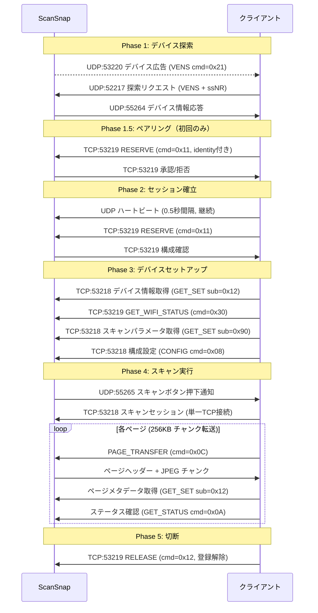
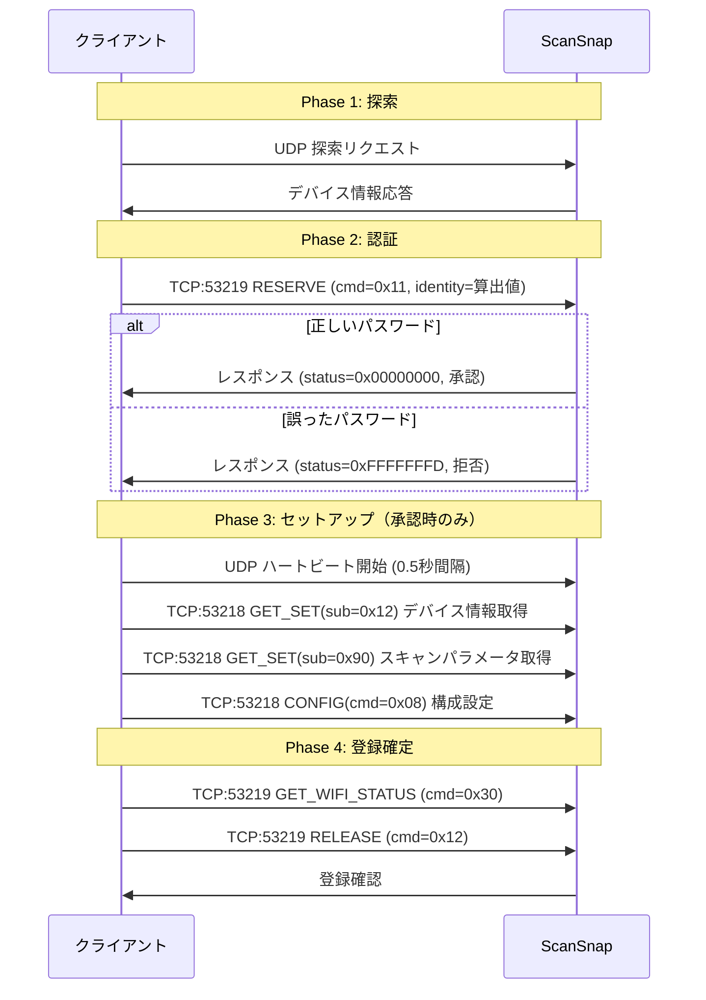
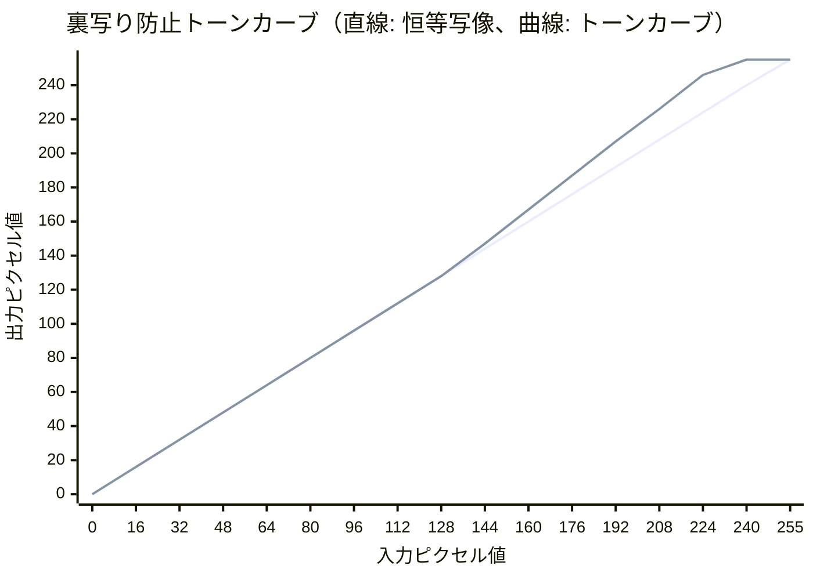
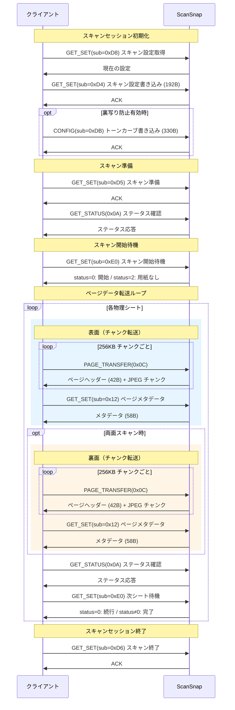
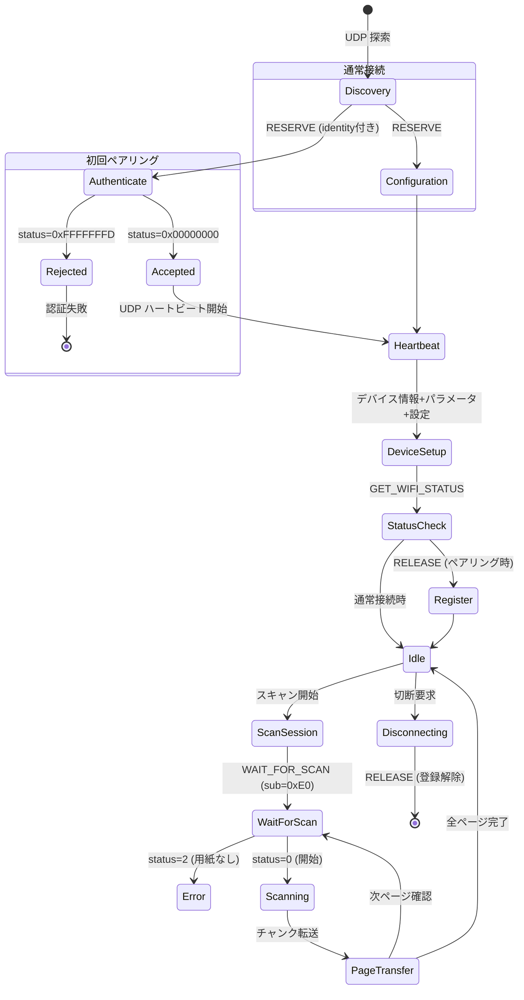

# レガシー版 ScanSnap ネットワークプロトコル仕様書

この仕様書は、ScanSnap iX500をネットワークを介してスキャナを操作した際にキャプチャしたパケットを元に組み立てたネットワークプロトコルをまとめたものです。公式の仕様ではないため、正確な情報である保証はありません。

## 1. 概要

ScanSnap iX500 は Wi-Fi 経由でクライアントアプリケーション（iOS/Android）と通信し、スキャン設定の変更やスキャンデータの転送を行う。プロトコルは独自バイナリ形式で、マジックバイト `VENS`（`0x56454e53`）を共通識別子として使用する。バイトオーダーはすべて**ビッグエンディアン**。

### 1.1 ネットワーク構成

ScanSnap（サーバー）が TCP ポート 53218/53219 でリッスンし、クライアントが接続する。デバイス探索は UDP で行われる。

### 1.2 使用ポート

| ポート | プロトコル | 方向 | 用途 |
|-------|-----------|------|------|
| 53218 | TCP | サーバー側リッスン | データチャネル（設定読み書き・スキャンデータ転送） |
| 53219 | TCP | サーバー側リッスン | 制御チャネル（セッション管理・ステータス確認） |
| 53220 | UDP | ブロードキャスト受信 | デバイス広告（スキャナーからブロードキャスト） |
| 52217 | UDP | サーバー側 | デバイス探索応答 |
| 55264 | UDP | クライアント側 | デバイス探索リクエスト送信 |
| 55265 | UDP | クライアント側リッスン | イベント通知受信（スキャンボタン押下等） |

### 1.3 通信の全体フロー



---

## 2. 共通パケット構造

### 2.1 VENS パケットヘッダー

```
 0                   1                   2                   3
 0 1 2 3 4 5 6 7 8 9 0 1 2 3 4 5 6 7 8 9 0 1 2 3 4 5 6 7 8 9 0 1
+-+-+-+-+-+-+-+-+-+-+-+-+-+-+-+-+-+-+-+-+-+-+-+-+-+-+-+-+-+-+-+-+
|                      Packet Length                            |
+-+-+-+-+-+-+-+-+-+-+-+-+-+-+-+-+-+-+-+-+-+-+-+-+-+-+-+-+-+-+-+-+
|                    Magic ("VENS" = 0x56454e53)                |
+-+-+-+-+-+-+-+-+-+-+-+-+-+-+-+-+-+-+-+-+-+-+-+-+-+-+-+-+-+-+-+-+
|                     Command / Direction                       |
+-+-+-+-+-+-+-+-+-+-+-+-+-+-+-+-+-+-+-+-+-+-+-+-+-+-+-+-+-+-+-+-+
|                      Status / Flags                           |
+-+-+-+-+-+-+-+-+-+-+-+-+-+-+-+-+-+-+-+-+-+-+-+-+-+-+-+-+-+-+-+-+
|                      Payload (可変長)                          |
+-+-+-+-+-+-+-+-+-+-+-+-+-+-+-+-+-+-+-+-+-+-+-+-+-+-+-+-+-+-+-+-+
```

| オフセット | サイズ | フィールド | 説明 |
|-----------|--------|-----------|------|
| 0 | 4 | Packet Length | パケット全体のバイト数（このフィールド自身を含む） |
| 4 | 4 | Magic | 固定値 `0x56454e53`（ASCII: "VENS"） |
| 8 | 4 | Command / Direction | 制御チャネル: コマンド種別、データチャネル: 方向 |
| 12 | 4 | Status / Flags | ステータスコードまたはフラグ |
| 16+ | 可変 | Payload | コマンド固有のデータ |

### 2.2 チャネル別ヘッダー差異

制御チャネル（TCP:53219）とデータチャネル（TCP:53218）でオフセット 8 以降の解釈が異なる。

**制御チャネル:**

| オフセット | サイズ | フィールド |
|-----------|--------|-----------|
| 8 | 4 | コマンドコード（0x11, 0x12, 0x30） |
| 12 | 4 | フラグ / ステータス |
| 16 | 8 | セッショントークン |
| 24+ | 可変 | コマンドパラメータ |

**データチャネル — クライアントリクエスト:**

| オフセット | サイズ | フィールド |
|-----------|--------|-----------|
| 8 | 4 | 方向（固定: `0x00000001` = C→S） |
| 12 | 4 | 予約（`0x00000000`） |
| 16 | 8 | セッショントークン |
| 24 | 8 | 予約 |
| 32 | 4 | コマンドコード |
| 36+ | 可変 | コマンドパラメータ |

**データチャネル — サーバーレスポンス:**

| オフセット | サイズ | フィールド |
|-----------|--------|-----------|
| 8 | 4 | 方向（固定: `0x00000000` = S→C） |
| 12 | 4 | ステータスコード |
| 16 | 24 | 予約（ゼロ埋め） |
| 40+ | 可変 | レスポンスデータ |

---

## 3. UDP デバイス探索プロトコル

### 3.1 デバイス広告

ScanSnap は定期的に UDP ポート 53220 宛にブロードキャストパケット（48バイト）を送信して自身の存在を通知する。

| オフセット | サイズ | フィールド | 値 |
|-----------|--------|-----------|-----|
| 0 | 4 | Packet Length | `0x00000030` (48) |
| 4 | 4 | Magic | "VENS" |
| 8 | 4 | Command | `0x00000021` |
| 12 | 4 | Reserved | `0x00000000` |
| 16 | 4 | Device Flags | `0x01000000` |
| 20 | 4 | Device IP | スキャナーの IPv4 アドレス（ネットワークバイトオーダー） |
| 24 | 8 | Device ID | MAC アドレス（6バイト）+ パディング |
| 32 | 16 | Reserved | ゼロ埋め |

### 3.2 探索リクエスト（クライアント → スキャナー）

クライアントは2種類のパケットを UDP ポート 52217 宛に対で送信する。

**VENS リクエスト（32バイト）:**

| オフセット | サイズ | フィールド | 説明 |
|-----------|--------|-----------|------|
| 0 | 4 | Magic | `0x56454e53` ("VENS") |
| 4 | 4 | Flags | `0x00000000`（探索）/ `0x00000001`（接続維持ハートビート） |
| 8 | 4 | Client IP | クライアントの IPv4 アドレス |
| 12 | 8 | Session Token | セッショントークン（6バイトランダム + `0x0000`） |
| 20 | 4 | Client UDP Port | クライアントの探索ポート（55264） |
| 24 | 8 | Flags / Reserved | `0x0010000000000000` |

**ssNR リクエスト（32バイト）:**

| オフセット | サイズ | フィールド | 説明 |
|-----------|--------|-----------|------|
| 0 | 4 | Magic | `0x73734e52` ("ssNR") |
| 4 | 4 | Reserved | `0x00000000` |
| 8 | 4 | Client IP | クライアントの IPv4 アドレス |
| 12 | 8 | Session Token | VENS リクエストと同一のトークン |
| 20 | 4 | Client UDP Port | 55264 |
| 24 | 8 | Reserved | `0x0100000000000000` |

ssNR パケットは VENS リクエストと対で送信され、クライアントのネットワーク情報を通知する。

### 3.3 探索レスポンス（スキャナー → クライアント）

スキャナーは UDP ポート 52217 からクライアントの UDP ポート 55264 宛にデバイス情報（132バイト）を返す。

| オフセット | サイズ | フィールド | 説明 |
|-----------|--------|-----------|------|
| 0 | 4 | Magic | "VENS" |
| 4 | 2 | Paired Status | `0x0000`=未接続 / `0x0001`=接続中 |
| 6 | 2 | Reserved | `0x0000` |
| 8 | 2 | Protocol Version | `0x0004` |
| 10 | 2 | Sub-type | `0x0030` |
| 12 | 4 | Broadcast Mask | `0xFFFFFFFF` |
| 16 | 4 | Device IP | スキャナーの IPv4 アドレス |
| 20 | 2 | Reserved | `0x0000` |
| 22 | 2 | TCP Data Port | データチャネルポート（通常 53218） |
| 24 | 2 | Reserved | `0x0000` |
| 26 | 2 | TCP Control Port | 制御チャネルポート（通常 53219） |
| 28 | 6 | Device MAC | スキャナーの MAC アドレス |
| 34 | 2 | Reserved | `0x0000` |
| 36 | 4 | State | `0x00000001`=未接続 / `0x00000003`=接続中 |
| 40 | 64 | Serial Number | デバイスシリアル番号（null-padded ASCII） |
| 104 | 16 | Display Name | デバイス表示名（null-padded ASCII） |
| 120 | 4 | Connected Client IP | 接続中クライアントの IP（未接続時 `0x00000000`） |
| 124 | 8 | Device Metadata | デバイスメタデータ |

### 3.4 イベント通知（スキャナー → クライアント）

スキャンボタン押下時などに、スキャナーからクライアントの UDP ポート 55265 宛に通知パケット（48バイト）が送信される。この通知は約0.5秒間隔で複数回繰り返し送信される。

| オフセット | サイズ | フィールド | 説明 |
|-----------|--------|-----------|------|
| 0 | 4 | Packet Length | `0x00000030` (48) |
| 4 | 4 | Magic | "VENS" |
| 8 | 4 | Event Type | `0x00000001`=スキャンボタン押下 |
| 12 | 4 | Reserved | `0x00000000` |
| 16 | 4 | Event Data | `0x02000000` |
| 20 | 28 | Reserved | ゼロ埋め |

通知を受信したクライアントはスキャンデータ受信用の TCP 接続を開始する。

---

## 4. TCP 制御チャネル（ポート 53219）

セッション管理に使用される。すべての TCP 接続開始時に、サーバーは Welcome パケット（16バイト）を送信する。

**Welcome パケット（16バイト）:**

| オフセット | サイズ | フィールド | 値 |
|-----------|--------|-----------|-----|
| 0 | 4 | Length | `0x00000010` (16) |
| 4 | 4 | Magic | "VENS" |
| 8 | 8 | Reserved | `0x0000000000000000` |

### 4.1 コマンド一覧

| コマンドコード | 名称 | 方向 | 説明 |
|---------------|------|------|------|
| `0x00000011` | RESERVE | C→S | スキャナー予約（クライアント構成情報の送信） |
| `0x00000012` | RELEASE | C→S | スキャナー解放（セッション登録 / 登録解除） |
| `0x00000030` | GET_WIFI_STATUS | C→S | Wi-Fi ステータス確認 |

### 4.2 セッション登録（RELEASE: 0x12）

セッションの登録および登録解除に使用される。

**リクエスト（32バイト）:**

| オフセット | サイズ | フィールド | 値 |
|-----------|--------|-----------|-----|
| 0 | 4 | Length | `0x00000020` (32) |
| 4 | 4 | Magic | "VENS" |
| 8 | 4 | Command | `0x00000012` |
| 12 | 4 | Flags | `0x00000000` |
| 16 | 8 | Token | セッショントークン |
| 24 | 4 | Action | `0x00000001` |
| 28 | 4 | Reserved | `0x00000000` |

**レスポンス（16バイト）:** 固定長の ACK パケット。

### 4.3 スキャナー予約（RESERVE: 0x11）

クライアントが自身の情報（IPアドレス、通知ポート、現在時刻、identity）をスキャナーに送信する。ペアリングおよび通常接続の両方で使用される。

**リクエスト（384バイト）:**

| オフセット | サイズ | フィールド | 説明 |
|-----------|--------|-----------|------|
| 0 | 4 | Length | `0x00000180` (384) |
| 4 | 4 | Magic | "VENS" |
| 8 | 4 | Command | `0x00000011` |
| 12 | 4 | Flags | `0x00000000` |
| 16 | 8 | Session Token | セッショントークン |
| 24 | 8 | Reserved | ゼロ埋め |
| 32 | 4 | Config Version | `0x00040500` |
| 36 | 4 | Reserved | `0x00000001` |
| 40 | 4 | Client Count | `0x00000001` |
| 44 | 4 | Client IP | クライアントの IPv4 アドレス |
| 48 | 4 | Notification Port | イベント通知用ポート（55265） |
| 52 | 48 | Identity String | ペアリング identity（§4.5 参照、null-padded ASCII） |
| 100 | 2 | Year | 現在年（big-endian） |
| 102 | 1 | Month | 現在月 |
| 103 | 1 | Day | 現在日 |
| 104 | 1 | Hour | 現在時 |
| 105 | 1 | Minute | 現在分 |
| 106 | 1 | Second | 現在秒 |
| 107 | 1 | Reserved | `0x00` |
| 108 | 8 | Reserved | ゼロ埋め |
| 116 | 4 | Client Type | `0xFFFF8170` |
| 120 | 264 | Reserved | ゼロ埋め |

**レスポンス（20バイト）:**

| オフセット | サイズ | フィールド | 説明 |
|-----------|--------|-----------|------|
| 0 | 4 | Length | `0x00000014` (20) |
| 4 | 4 | Magic | "VENS" |
| 8 | 4 | Status | ステータスコード（下記参照） |
| 12 | 4 | Protocol Version | `0x00040000` |
| 16 | 4 | Reserved | `0x00000000` |

**Status 値:**

| 値 | 意味 |
|----|------|
| `0x00000000` | 承認（ペアリング成功 / セッション確立） |
| `0xFFFFFFFD` (-3) | 拒否（不正な identity） |

### 4.4 Wi-Fi ステータス確認（GET_WIFI_STATUS: 0x30）

接続確認やスキャン後のステータス取得に使用される。

**リクエスト（32バイト）:**

| オフセット | サイズ | フィールド | 値 |
|-----------|--------|-----------|-----|
| 0 | 4 | Length | `0x00000020` (32) |
| 4 | 4 | Magic | "VENS" |
| 8 | 4 | Command | `0x00000030` |
| 12 | 4 | Flags | `0x00000000` |
| 16 | 8 | Session Token | |
| 24 | 8 | Reserved | |

**レスポンス（32バイト）:**

| オフセット | サイズ | フィールド | 説明 |
|-----------|--------|-----------|------|
| 0 | 4 | Length | `0x00000020` (32) |
| 4 | 4 | Magic | "VENS" |
| 8 | 4 | Status | |
| 12 | 4 | Reserved | |
| 16 | 4 | State | `0x00000003` = 接続済み |
| 20 | 12 | Reserved | |

### 4.5 ペアリングプロトコル

初回接続時にスキャナーとクライアントをペアリングするプロトコル。パスワード認証方式で、物理ボタンの押下は不要。ペアリング完了後は identity を保存し、以降の接続で RESERVE リクエストに含めることでセッションが確立される。

#### 4.5.1 Identity 算出アルゴリズム

スキャナーに送信する identity 文字列は、パスワード・鍵文字列・シフト定数から算出される。

```
KEY   = "pFusCANsNapFiPfu"    // 全機種共通の鍵文字列（16文字）
SHIFT = 11                     // 固定シフト値

identity[i] = str(ord(password[i]) + ord(KEY[i]) + SHIFT)
identity = concat(identity[0], identity[1], ..., identity[n-1])
```

- パスワード各文字の ASCII コードに、鍵の対応位置の ASCII コードとシフト値を加算
- 各値を10進数文字列に変換し、連結
- パスワードの最大長は16文字（鍵文字列長）

**鍵文字列の base 値一覧（`ord(KEY[i]) + SHIFT`）:**

```
i:    0    1    2    3    4    5    6    7    8    9   10   11   12   13   14   15
KEY:  p    F    u    s    C    A    N    s    N    a    p    F    i    P    f    u
base: 123  81   128  126  78   76   89   126  89   108  123  81   116  91   113  128
```

**算出例（パスワード "0700"）:**

```
identity[0] = 123 + ord('0') = 123 + 48 = 171  → "171"
identity[1] =  81 + ord('7') =  81 + 55 = 136  → "136"
identity[2] = 128 + ord('0') = 128 + 48 = 176  → "176"
identity[3] = 126 + ord('0') = 126 + 48 = 174  → "174"

identity = "171136176174"
```

#### 4.5.2 ペアリングフロー



---

## 5. TCP データチャネル（ポート 53218）

デバイス情報の取得、スキャン設定の読み書き、スキャンデータの転送に使用される。

### 5.1 コマンド一覧

| コマンドコード | 名称 | 説明 |
|---------------|------|------|
| `0x00000006` | GET_SET | デバイス情報・スキャン設定の取得/設定（サブコマンドで区別） |
| `0x00000008` | CONFIG | スキャナー構成の読み書き |
| `0x0000000A` | GET_STATUS | スキャンステータスの取得 |
| `0x0000000C` | PAGE_TRANSFER | スキャンページデータの転送要求 |

### 5.2 接続シーケンス

すべてのデータチャネル接続は以下のパターンで始まる:

1. クライアントが TCP:53218 に接続
2. サーバーが Welcome パケット（16バイト）を送信
3. クライアントがコマンドを送信
4. サーバーがレスポンスを返す

### 5.3 GET_SET コマンド（0x06）

サブコマンドにより動作が変わる汎用的なコマンド。

**サブコマンド一覧:**

| サブコマンド | 名称 | 説明 |
|------------|------|------|
| `0x12` | デバイス情報取得 | デバイス名・ファームウェアバージョン等 |
| `0x90` | スキャンパラメータ取得 | スキャナー能力（最大解像度・カラーモード等） |
| `0xD4` | スキャン設定書き込み | カラー・品質・用紙サイズ等の設定 |
| `0xD5` | スキャン準備 | スキャンセッション内で使用 |
| `0xD8` | スキャン設定取得 | 現在の設定を読み出し |
| `0xD6` | スキャン終了 | スキャンセッション終了（スキャナー状態リセット） |
| `0xE0` | スキャン開始待機 | ボタン押下/トリガーまでブロック |

#### 5.3.1 デバイス情報取得（sub=0x12）

**リクエスト（64バイト）:**

| オフセット | サイズ | フィールド | 値 |
|-----------|--------|-----------|-----|
| 0 | 4 | Length | `0x00000040` (64) |
| 4 | 4 | Magic | "VENS" |
| 8 | 4 | Direction | `0x00000001` |
| 12 | 4 | Reserved | `0x00000000` |
| 16 | 8 | Session Token | |
| 24 | 8 | Reserved | |
| 32 | 4 | Command | `0x00000006` |
| 36 | 4 | Data Size | `0x00000060` (96) |
| 40 | 8 | Reserved | |
| 48 | 4 | Sub-command | `0x12000000` |
| 52 | 4 | Response Buffer Size | `0x60000000` |
| 56 | 8 | Reserved | |

**レスポンス（136バイト）:**

| オフセット | サイズ | フィールド | 説明 |
|-----------|--------|-----------|------|
| 0 | 4 | Length | `0x00000088` (136) |
| 4 | 4 | Magic | "VENS" |
| 8 | 32 | Header | ゼロ埋め |
| 40 | 2 | Command Echo | `0x0006` |
| 42 | 4 | Device Version | デバイスバージョン |
| 46 | 2 | Reserved | |
| 48 | 1 | Name Length | デバイス名の長さ |
| 49 | 32 | Device Name | デバイス名（ASCII） |
| 81 | 2 | Firmware Major | ファームウェアメジャーバージョン |
| 83 | 1 | Firmware Minor | ファームウェアマイナーバージョン |
| 84 | 52 | Reserved | ゼロ埋め |

#### 5.3.2 スキャン設定取得（sub=0xD8）

**リクエスト（64バイト）:** Sub-command = `0xD8000000`

**レスポンス（40バイト）:** 設定がない場合は空レスポンス

#### 5.3.3 スキャンパラメータ取得（sub=0x90）

**リクエスト（64バイト）:** Sub-command = `0x1201F000`, Response Buffer Size = `0x90000000`

**レスポンス（184バイト）:**

| オフセット | サイズ | フィールド | 説明 |
|-----------|--------|-----------|------|
| 40 | 2 | Command Echo | `0x0006` |
| 42 | 2 | Param ID | `0xF002` |
| 44 | 2 | Data Length | パラメータデータ長 |
| 46 | 2 | Max Resolution X | 最大解像度 X（DPI） |
| 48 | 2 | Max Resolution Y | 最大解像度 Y（DPI） |
| 50 | 1 | Color Modes | 対応カラーモード（ビットマスク） |
| 51 | 2 | Default Res X | デフォルト解像度 X（DPI） |
| 53 | 2 | Default Res Y | デフォルト解像度 Y（DPI） |
| 55 | 2 | Min Resolution | 最小解像度（DPI） |
| 57 | 2 | Max Width | 最大幅 |
| 59+ | 可変 | Additional Params | JPEG品質、用紙サイズ等 |

#### 5.3.4 スキャン設定書き込み（sub=0xD4）

スキャン設定の全パラメータを送信する SET コマンド。

**リクエスト（192バイト）:**

| オフセット | サイズ | フィールド | 値 |
|-----------|--------|-----------|-----|
| 0 | 4 | Length | `0x000000C0` (192) |
| 4 | 4 | Magic | "VENS" |
| 8 | 4 | Direction | `0x00000001` |
| 16 | 8 | Session Token | |
| 32 | 4 | Command | `0x00000006` |
| 36 | 4 | Data Size | `0x000000A0` (160) |
| 48 | 4 | Sub-command | `0xD4000000` |
| 64+ | 128 | Config Data | 下記参照 |

**Config Data バイトマッピング（オフセット 64 からの相対位置）:**

表面・裏面のスキャン設定が同一構造で2回格納される（表面: +31〜、裏面: +63〜）。共通フラグは +1〜+12 に配置。

| 相対オフセット | サイズ | フィールド | 値 | 説明 |
|---------------|--------|-----------|-----|------|
| +1 | 1 | Duplex | `0x03`=両面, `0x01`=片面 | |
| +2 | 1 | 定数 | `0x01` | |
| +3 | 1 | 定数 | `0x01` | |
| +4 | 1 | Multi-feed Detection | `0xD0`=ON, `0x80`=OFF | |
| +5 | 1 | 定数 | `0x01` | |
| +6 | 1 | Multi-feed Detection | `0xC1`=ON, `0xC0`=OFF | +4 と連動 |
| +7 | 1 | Auto Color+Quality | `0xC1`=auto色かつauto品質, `0x80`=指定あり | |
| +8 | 1 | Blank Page Removal | `0xE0`=ON, `0x80`=OFF | |
| +9 | 1 | 定数 | `0xC8` | |
| +10 | 1 | Auto Quality | `0xA0`=auto品質, `0x80`=品質指定 | |
| +11 | 1 | Bleed-through | `0xC0`=裏写り防止ON, `0x80`=OFF | CONFIG(sub=0xDB) トーンカーブ送信が必要 |
| +12 | 1 | 定数 | `0x80` | |

**表面パラメータ（+31〜）:**

| 相対オフセット | サイズ | フィールド | 説明 |
|---------------|--------|-----------|------|
| +31 | 1 | 定数 | `0x30` |
| +33 | 1 | Color/BW Flag | `0x10`=カラー/グレー/auto, `0x40`=白黒 |
| +34 | 2 | Resolution X | DPI, big-endian（0=auto） |
| +36 | 2 | Resolution Y | DPI, big-endian（0=auto） |
| +38 | 3 | Color Encoding | カラーモードのエンコーディング（下記参照） |
| +44 | 2 | Paper Width | 1/1200インチ単位, big-endian（0=auto） |
| +48 | 2 | Paper Height | 1/1200インチ単位, big-endian（0=auto） |
| +50 | 1 | 定数 | `0x04` |
| +54 | 3 | 定数 | `0x010101` |
| +57 | 1 | BW Flag | `0x01`=白黒, `0x00`=その他 |
| +60 | 1 | BW Density | 密度値 + 6（範囲: 6〜16、対応値: 0〜10） |

裏面パラメータ（+63〜）は表面と同一構造。

**Color Encoding（+38〜+40）:**

| バイト列 | カラーモード | 備考 |
|---------|------------|------|
| `05 82 0B` | カラー | 通常用紙 |
| `05 82 09` | カラー | はがき (POSTCARD) |
| `02 82 0B` | グレー | 通常用紙 |
| `02 82 09` | グレー | はがき (POSTCARD) |
| `00 03 00` | 白黒 | 用紙サイズ非依存 |

3バイト目は用紙サイズに依存し、はがき (POSTCARD) の場合 `0x09`、その他は `0x0B`。

**用紙サイズ定数（幅 × 高さ, 1/1200インチ単位）:**

| 用紙 | 幅 | 高さ | mm換算 |
|------|-----|------|--------|
| AUTO | 0 | 0 | 自動検出 |
| A4 | 9920 | 14032 | 210.0 × 297.0 |
| A5 | 6992 | 9920 | 148.2 × 210.0 |
| BUSINESS_CARD | 2552 | 4252 | 54.1 × 90.1 |
| POSTCARD | 4724 | 6992 | 100.1 × 148.2 |

**解像度（DPI）:**

| 品質 | DPI | hex |
|------|-----|-----|
| AUTO | 0 | `0x0000` |
| NORMAL | 200 | `0x00C8` |
| FINE | 300 | `0x012C` |
| SUPERFINE | 600 | `0x0258` |

#### 5.3.5 ページメタデータ取得（sub=0x12, スキャンセッション内）

ページ転送後にページの詳細情報を取得する。セッション確立時の sub=0x12（デバイス情報取得）とは異なるパラメータで送信される。

**リクエスト（64バイト）:**

| オフセット | サイズ | フィールド | 値 |
|-----------|--------|-----------|-----|
| 32 | 4 | Command | `0x00000006` |
| 36 | 4 | Param | `0x00000012` |
| 48 | 4 | Sub-param | `0x03000000` |
| 52 | 4 | Size | `0x12000000` |

**レスポンス（58バイト）:**

| オフセット | サイズ | フィールド | 説明 |
|-----------|--------|-----------|------|
| 0 | 4 | Length | `0x0000003A` (58) |
| 4 | 4 | Magic | "VENS" |
| 8 | 32 | Header | ゼロ埋め |
| 40 | 2 | Image Format | `0xF000` |
| 42 | 2 | Page Dimensions | 解像度関連 |
| 44 | 4 | Total Image Size | ページペアの合計サイズ |
| 48 | 10 | Reserved | ゼロ埋め |

#### 5.3.6 スキャン終了（sub=0xD6）

スキャンセッション終了時に送信する。スキャナーの内部状態をリセットし、次のスキャンを受け付け可能にする。スキャン完了後の後始末として必ず送信する（スキャンセッション内の同一 TCP 接続上で送信）。

**リクエスト（64バイト）:**

共通の GET_SET フォーマット。Sub-command = `0xD6`。

**レスポンス（40バイト）:** 標準の空レスポンス。

#### 5.3.7 スキャン開始待機（sub=0xE0）

スキャンの開始を待機するブロッキングコマンド。ボタン押下またはアプリからのトリガー後にレスポンスが返る。

スキャン開始前とページ転送後の両方で使用される。レスポンスのステータスコードで用紙の有無・スキャン継続可否を判定する。

**リクエスト（64バイト）:**

共通の GET_SET フォーマット。Sub-command = `0xE0`。

**レスポンス（40バイト）:**

| オフセット | サイズ | フィールド | 説明 |
|-----------|--------|-----------|------|
| 0 | 4 | Length | `0x00000028` (40) |
| 4 | 4 | Magic | "VENS" |
| 8 | 4 | Reserved | `0x00000000` |
| 12 | 4 | Status | ステータスコード |
| 16 | 24 | Reserved | ゼロ埋め |

**ステータスコード:**

| 値 | 意味 |
|----|------|
| `0x00000000` | 成功 — スキャン開始/次ページ準備完了 |
| `0x00000002` | 終了 — 用紙なしまたはスキャン完了 |

用紙がない場合、クライアント側でエラーを生成して中断する（プロトコル上のエラー通知は存在しない）。

### 5.4 GET_STATUS コマンド（0x0A）

スキャン中のステータスを確認する。スキャン進行状態やデバイス状態フラグを取得する。

用紙の有無はオフセット 40 の Scan Status フィールドで判定する。ビット `0x80` がセットされている場合、ADF に用紙がない（または準備未完了）。

**リクエスト（64バイト）:**

| オフセット | サイズ | フィールド | 値 |
|-----------|--------|-----------|-----|
| 32 | 4 | Command | `0x0000000A` |
| 36 | 4 | Buffer Size | `0x00000020` (32) |
| 48 | 4 | Status Type | `0xC2000000` |
| 56 | 4 | Response Size | `0x20000000` |

**レスポンス（72バイト）:**

| オフセット | サイズ | フィールド | 説明 |
|-----------|--------|-----------|------|
| 0 | 4 | Length | `0x00000048` (72) |
| 4 | 36 | Header | ゼロ埋め |
| 40 | 4 | Scan Status | `0x00000000`=用紙あり（準備完了）, `0x00000080`=用紙なし（未準備） |
| 44 | 4 | Reserved | 固定値（用紙検出には使用不可） |
| 48 | 8 | Reserved | |
| 56 | 4 | Device Flags | デバイス状態フラグ |
| 60 | 12 | Reserved | ゼロ埋め |

**用紙検出:**

```
has_paper = (scan_status & 0x80) == 0
```

用紙がない場合、WAIT_FOR_SCAN を送信せずにクライアント側でエラーを生成して中断する。

> **注:** オフセット 44 は用紙の有無に関わらず同一の値（`0x00010000`）を返す場合がある。用紙検出にはオフセット 40 の Scan Status を使用すること。

### 5.5 CONFIG コマンド（0x08）

CONFIG コマンドはデータチャネル共通ヘッダーにコマンド `0x00000008` を使用する。サブコマンドにより異なる構成操作を行う。

**サブコマンド一覧:**

| サブコマンド | 名称 | 説明 |
|------------|------|------|
| `0xEB` | 構成設定 | 接続時の初期構成設定 |
| `0xDB` | トーンカーブ書き込み | 裏写り防止用トーンカーブ（256バイト LUT） |

#### 5.5.1 構成設定（sub=0xEB）

**リクエスト（68バイト）:**

| オフセット | サイズ | フィールド | 値 |
|-----------|--------|-----------|-----|
| 32 | 4 | Command | `0x00000008` |
| 36 | 4 | Reserved | `0x00000000` |
| 40 | 4 | Config Type | `0x00000004` |
| 44 | 4 | Reserved | `0x00000000` |
| 48 | 4 | Config Value | `0xEB000000` |
| 52 | 4 | Reserved | `0x00040000` |
| 56 | 8 | Reserved | |
| 64 | 4 | Sub-config | `0x05010000` |

**レスポンス（40バイト）:** 標準の空レスポンス、ステータス `0x00000002`

#### 5.5.2 トーンカーブ書き込み（sub=0xDB）

裏写り防止が有効な場合、スキャンセッション内でスキャン設定書き込み（sub=0xD4）の後に送信する。256バイトのルックアップテーブル（LUT）を含み、スキャナーのトーンカーブを調整してハイライトを強調し裏写りを軽減する。

**必要条件:** Config Data オフセット +11 の裏写り防止フラグが `0xC0` に設定されている場合。このコマンドなしでは、スキャナーは WAIT_FOR_SCAN で status=2 を返しスキャンを拒否する。

**リクエスト（330バイト）:**

| オフセット | サイズ | フィールド | 値 |
|-----------|--------|-----------|-----|
| 0 | 4 | Length | `0x0000014A` (330) |
| 4 | 4 | Magic | "VENS" |
| 8 | 4 | Direction | `0x00000001` |
| 12 | 4 | Reserved | `0x00000000` |
| 16 | 8 | Session Token | |
| 24 | 8 | Reserved | |
| 32 | 4 | Command | `0x00000008` |
| 36 | 4 | Reserved | `0x00000000` |
| 40 | 4 | Input Param Length | `0x0000010A` (266) |
| 44 | 4 | Reserved | `0x00000000` |
| 48 | 1 | Sub-command | `0xDB` |
| 49 | 1 | Sub-param | `0x85` |
| 50 | 14 | Parameters | `0x000000010A00...` |
| 64 | 10 | Tone Curve Header | `0x00001000010001000000` |
| 74 | 256 | LUT Data | 256バイトのトーンカーブ LUT |

**LUT 構造:**

LUT は入力ピクセル値（0〜255）を出力値にマッピングする:

| 入力範囲 | 出力 | 効果 |
|---------|------|------|
| `0x00`〜`0x83` | 恒等（出力 = 入力） | シャドウ部分はそのまま保持 |
| `0x84`〜`0xE5` | 段階的に明るく（+1〜+23） | 中間調〜ハイライトを強調 |
| `0xE6`〜`0xFF` | `0xFF` にクリップ | 白に近い値は白に変換 |

上位トーン領域の明るさを段階的に上げることで、裏面の透けによる薄い影を効果的に除去しつつ、より暗いコンテンツは保持する。



入力値 0〜131 では恒等写像（2本の線が重なる）。132 以降でトーンカーブが上方に乖離し、ハイライトが強調される。230 以降は 255 にクリップされる。

**レスポンス（40バイト）:** 標準の空レスポンス。

---

## 6. スキャンデータ転送

### 6.1 転送フロー

スキャンセッションは**単一の TCP 接続**上で実行される。すべてのステップが同一接続内で行われ、接続はスキャン完了まで維持される。



### 6.2 PAGE_TRANSFER コマンド（0x0C）

#### リクエスト（64バイト）

| オフセット | サイズ | フィールド | 説明 |
|-----------|--------|-----------|------|
| 0 | 4 | Length | `0x00000040` (64) |
| 4 | 4 | Magic | "VENS" |
| 8 | 4 | Direction | `0x00000001` |
| 12 | 4 | Reserved | `0x00000000` |
| 16 | 8 | Session Token | |
| 24 | 8 | Reserved | |
| 32 | 4 | Command | `0x0000000C` |
| 36 | 4 | Transfer Flags | `0x00040000` |
| 40 | 8 | Reserved | |
| 48 | 4 | Buffer Config | `0x28000002` |
| 52 | 4 | Page Flags | 下記参照 |
| 56 | 1 | Sheet Number | 0-based シート番号 |
| 57 | 1 | Side | 0=表 / 1=裏 |
| 58 | 6 | Reserved | |

**Page Flags:**

| 値 | 意味 |
|----|------|
| `0x00000400` | 表面 (front side) |
| `0x00800400` | 裏面 (back side) |

両面スキャン時は表裏で交互に切り替わる。片面スキャンでは常に `0x00000400`（表面）を使用する。

#### レスポンス（42バイトヘッダー + JPEG データ）

| オフセット | サイズ | フィールド | 説明 |
|-----------|--------|-----------|------|
| 0 | 4 | JPEG Data Size | 後続する JPEG チャンクのバイト数 |
| 4 | 4 | Magic | "VENS" |
| 8 | 4 | Reserved | `0x00000000` |
| 12 | 4 | Page Type | チャンク種別（下記参照） |
| 16 | 24 | Reserved | ゼロ埋め |
| 40 | 1 | Sheet Number | 0-based |
| 41 | 1 | Side | 0=表 / 1=裏 |

ヘッダー直後に JPEG Data Size バイトの JPEG データが TCP ストリーム上で続く。

**Page Type（チャンク種別）:**

| 値 | 意味 |
|----|------|
| `0x00000000` | 中間チャンク（後続チャンクあり） |
| `0x00000002` | 最終チャンク（ページ転送完了） |

### 6.3 チャンク転送

スキャナーは1ページの JPEG データを **256KB (262,144バイト)** 単位のチャンクに分割して送信する。クライアントはチャンクごとに PAGE_TRANSFER リクエストを送信し、全チャンクを連結して完全な JPEG を構築する。

**ページ番号の算出:**

```
page_num = (sheet << 8) | chunk_index
```

- `sheet`: 転送シート番号
- `chunk_index`: チャンクの 0-based インデックス

最終チャンクの JPEG Data Size は 256KB 未満となる場合がある。すべてのチャンクのデータを順番に連結すると、SOI (`0xFFD8`) から EOI (`0xFFD9`) までの完全な JPEG ファイルが得られる。

### 6.4 JPEG データフォーマット

転送される画像データは標準的な JPEG/JFIF フォーマット。

- **SOI マーカー:** `0xFFD8`
- **APP0 (JFIF):** バージョン 1.01
- **解像度:** スキャン設定の DPI 値に依存
- **コメント (COM):** `"PFU ScanSnap #iX500"`
- **EOI マーカー:** `0xFFD9`

---

## 7. セッションライフサイクル



---

## 8. セッショントークン

セッショントークンは8バイトで構成される。クライアント側で6バイトのランダム値を生成し、末尾2バイトを `0x0000` で固定する。このトークンは UDP 探索から TCP セッション終了まで一貫して使用される。

---

## 9. 既知の制限事項

以下の項目はプロトコルの詳細が未確定:

1. **エラーハンドリング** — 紙詰まりやマルチフィード検出時のプロトコル動作。用紙なしは WAIT_FOR_SCAN レスポンスの status=2 で検出するが、その他のエラー通知は未定義
2. **Config Data の一部定数** — +9: `0xC8`, +12: `0x80`, +31: `0x30`, +50: `0x04`, +54〜+56: `0x010101` の正確な意味
3. **CONFIG Sub-config 値** — `0x05010000` の正確な意味は不明

---

## 付録A: マジックバイト一覧

| マジック | Hex 値 | 使用箇所 |
|---------|--------|---------|
| `VENS` | `0x56454e53` | 全パケット共通のプロトコル識別子 |
| `ssNR` | `0x73734E52` | UDP 探索時のクライアント通知パケット |
